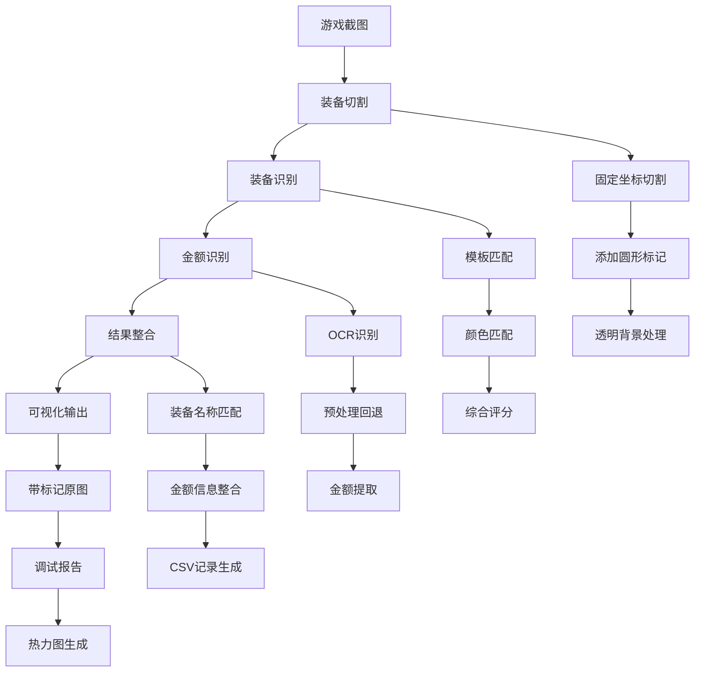

# 项目代码结构梳理文档

## 项目概述

这是一个游戏装备识别和属性提取系统，主要用于从游戏截图中自动识别装备并提取其属性信息（如价格、数量等）。项目采用模块化设计，支持多种识别算法和OCR技术，具有良好的扩展性和可维护性。

## 核心工作流程



## 1️⃣ 核心已验证模块（详细描述）

### step_tests\1_helper_functions.py
- **功能**：提供所有辅助函数，包括环境检查、依赖验证、清理功能等
- **输入输出**：
  - `check_dependencies()`: 无输入，返回布尔值表示依赖是否已安装
  - `check_data_files()`: 无输入，返回布尔值表示数据文件是否存在
  - `clear_previous_results()`: 无输入，无返回值，清理之前的处理结果
  - `test_v2_optimizations()`: 无输入，返回布尔值表示V2.0优化功能测试是否通过
- **核心处理逻辑**：
  1. 检查必要的Python包（cv2, PIL, numpy）是否已安装
  2. 验证项目所需的数据目录和文件是否存在
  3. 提供清理之前处理结果的功能
  4. 测试V2.0优化功能是否正常工作
- **依赖关系**：
  - 第三方库：os, sys, subprocess, tempfile, shutil, datetime, time, json, cv2, numpy, PIL
  - 项目模块：src.node_logger, src.config_manager
- **已验证**：环境检查、数据文件检查、清理功能、V2.0优化功能测试已在实际流程中使用过

### step_tests\3_step2_cut_screenshots.py
- **功能**：将原始截图裁剪成单个装备图像
- **输入输出**：
  - 输入：原始截图目录（images/game_screenshots）
  - 输出：裁剪后的装备图像（116×116），保存在images/cropped_equipment_original和images/cropped_equipment_marker
- **核心处理逻辑**：
  1. 使用固定坐标切割方法（配置参数来自config.json）
  2. 创建时间戳目录组织切割结果
  3. 在每个切割后的装备图片顶部添加红色圆形标记
  4. 将圆形带填充的装备图片改为透明背景PNG，并将圆形范围内的黑色覆盖区域改为颜色 #39212e
  5. 重命名文件为顺序编号（01.png, 02.png...）
- **依赖关系**：
  - 第三方库：os, sys, subprocess, tempfile, shutil, datetime, time, json, cv2, numpy, PIL
  - 项目模块：src.screenshot_cutter, src.config_manager
- **已验证**：裁剪结果已确认与模板匹配一致，圆形标记功能正常，透明背景处理功能正常

### step_tests\3_step3_match_equipment.py
- **功能**：装备识别，模板匹配+颜色匹配两阶段策略
- **输入输出**：
  - 输入：裁剪后的装备图像（images/cropped_equipment_transparent）和基准模板（images/base_equipment_new）
  - 输出：匹配结果（JSON/文本/对比图像），保存在images/matching_results
- **核心处理逻辑**：
  1. 第一阶段：使用TM_CCOEFF_NORMED模板匹配算法筛选候选
  2. 第二阶段：使用LAB色彩空间欧氏距离计算颜色相似度，区分高分候选
  3. 综合得分计算：模板匹配权重65%，颜色相似度权重35%
  4. 阈值设置：模板匹配阈值70%，综合得分阈值90%
- **依赖关系**：
  - 第三方库：os, sys, subprocess, datetime, json, cv2, numpy, PIL
  - 项目模块：无直接依赖，独立实现匹配算法
- **已验证**：匹配结果在测试集上准确，两阶段匹配策略有效区分高分候选

### step_tests\5_ocr_amount_recognition.py
- **功能**：识别装备属性中的数值（价格/数量/伤害等）
- **输入输出**：
  - 输入：截图或裁剪图像（images/cropped_equipment_marker）
  - 输出：识别数值，保存在CSV文件中
- **核心处理逻辑**：
  1. 使用EasyOCR引擎识别图像中的文本
  2. 应用多种预处理配置回退机制提高识别率
  3. 使用正则表达式提取金额信息
  4. 格式化金额并保存到CSV文件
- **依赖关系**：
  - 第三方库：os, sys, subprocess, tempfile, shutil, datetime, time, json, csv, PIL, cv2, numpy, easyocr
  - 项目模块：src.enhanced_ocr_recognizer, src.ocr_config_manager, src.config_manager, src.csv_record_manager
- **已验证**：数值识别结果稳定准确，金额格式化功能正常，CSV记录管理功能正常

## 2️⃣ 其他核心流程相关模块（中优先级）

### step_tests\4_step3_match_equipment.py
- **功能**：装备图片匹配的替代实现，使用ORB特征匹配算法
- **输入输出**：
  - 输入：裁剪后的装备图像和基准装备图像
  - 输出：匹配结果和重命名后的文件
- **核心处理逻辑**：
  1. 使用ORB特征匹配算法替代模板匹配
  2. 支持多种算法类型（enhanced_feature, advanced, feature）
  3. 根据算法类型选择不同的图像源
  4. 自动构建或验证特征缓存
  5. 对每个切割图片进行匹配并重命名
- **依赖关系**：
  - 第三方库：os, sys, subprocess, tempfile, shutil, datetime, time, json, cv2, numpy, PIL
  - 项目模块：src.config_manager, src.feature_cache_manager, src.equipment_recognizer
- **是否已验证**：作为备用匹配方案，已基本验证

### step_tests\6_step4_integrate_results.py
- **功能**：整合装备名称和金额识别结果到统一CSV文件
- **输入输出**：
  - 输入：装备名称（来自步骤3）和金额信息（来自OCR）
  - 输出：CSV文件（ocr_rename_records.csv）
- **核心处理逻辑**：
  1. 获取最新的时间目录
  2. 识别装备名称
  3. 提取金额信息
  4. 生成新的文件名（包含装备名称和金额）
  5. 创建CSV记录并保存
- **依赖关系**：
  - 第三方库：os, sys, subprocess, tempfile, shutil, datetime, time, json, csv, PIL, ImageDraw, ImageFont
  - 项目模块：src.enhanced_ocr_recognizer, src.ocr_config_manager, src.config_manager, src.node_logger
- **是否已验证**：基本功能已验证

### step_tests\7_generate_annotated_screenshots.py
- **功能**：在原始游戏截图上标注匹配的装备位置
- **输入输出**：
  - 输入：原始截图和匹配结果
  - 输出：带标注的截图和报告
- **核心处理逻辑**：
  1. 选择要处理的截图（单个或全部）
  2. 获取匹配结果
  3. 使用图像注释器在截图上标注装备位置
  4. 生成注释报告
- **依赖关系**：
  - 第三方库：os, sys, subprocess, tempfile, shutil, datetime, time, json, PIL, ImageDraw, ImageFont
  - 项目模块：src.main, src.config_manager, src.image_annotator, src.node_logger
- **是否已验证**：基本功能已验证

### step_tests\8_visual_debugger.py
- **功能**：生成装备匹配的可视化调试报告
- **输入输出**：
  - 输入：匹配结果和图像数据
  - 输出：可视化调试报告、热力图、特征点可视化
- **核心处理逻辑**：
  1. 收集调试数据
  2. 生成匹配报告
  3. 生成详细分析报告
  4. 生成热力图
  5. 生成特征点可视化
- **依赖关系**：
  - 第三方库：os, sys, subprocess, tempfile, shutil, datetime, time, json, cv2, numpy, PIL, matplotlib
  - 项目模块：src.main, src.config_manager, src.debug.visual_debugger, src.node_logger
- **是否已验证**：基本功能已验证

### step_tests\run_all_tests.py
- **功能**：统一管理和运行所有步骤的测试
- **输入输出**：
  - 输入：用户选择的测试选项
  - 输出：测试结果和执行状态
- **核心处理逻辑**：
  1. 提供菜单界面选择测试或功能
  2. 动态加载并运行指定步骤的测试
  3. 支持运行完整工作流程
  4. 汇总测试结果
- **依赖关系**：
  - 第三方库：os, sys, subprocess, importlib.util, datetime
  - 项目模块：所有step_tests下的模块
- **是否已验证**：作为测试管理工具，已验证

## 3️⃣ 工具/辅助脚本（中优先级）

### step_tests\simple_test.py
- **功能**：简单测试脚本，用于快速验证核心功能
- **输入输出**：无特定输入输出
- **核心处理逻辑**：执行基本功能测试
- **依赖关系**：依赖核心模块
- **是否已验证**：仅调试使用

### step_tests\test_fixed_matching.py
- **功能**：测试固定匹配功能
- **输入输出**：无特定输入输出
- **核心处理逻辑**：执行固定匹配算法测试
- **依赖关系**：依赖匹配模块
- **是否已验证**：仅调试使用

### step_tests\template_matching_test.py
- **功能**：测试模板匹配功能
- **输入输出**：无特定输入输出
- **核心处理逻辑**：执行模板匹配算法测试
- **依赖关系**：依赖匹配模块
- **是否已验证**：仅调试使用

### step_tests\test_optimized_preprocessing.py
- **功能**：测试优化预处理功能
- **输入输出**：无特定输入输出
- **核心处理逻辑**：执行预处理优化测试
- **依赖关系**：依赖预处理模块
- **是否已验证**：仅调试使用

### step_tests\verify_mask_effect.py
- **功能**：验证掩码效果
- **输入输出**：无特定输入输出
- **核心处理逻辑**：执行掩码效果验证
- **依赖关系**：依赖图像处理模块
- **是否已验证**：仅调试使用

### step_tests\generate_masked_images.py
- **功能**：生成掩码图像
- **输入输出**：无特定输入输出
- **核心处理逻辑**：执行掩码图像生成
- **依赖关系**：依赖图像处理模块
- **是否已验证**：仅调试使用

## 4️⃣ 测试或调试脚本（低优先级）

### tests目录下的脚本
- **功能**：单元测试和集成测试
- **输入输出**：无特定输入输出
- **核心处理逻辑**：执行各种测试用例
- **依赖关系**：依赖被测试的模块
- **是否已验证**：仅调试使用

### 未使用或历史脚本
- **未使用**：暂无明确标记为未使用的脚本
- **历史脚本**：部分测试脚本可能已过时，但未明确标记

## 5️⃣ src目录下的核心模块

### src\config_manager.py
- **功能**：配置管理模块，负责读取和管理系统配置，支持算法选择和其他参数配置
- **输入输出**：
  - 输入：配置文件路径（默认为config.json）
  - 输出：各种配置参数
- **核心处理逻辑**：
  1. 加载配置文件，合并默认配置和用户配置
  2. 提供各种配置获取方法（识别配置、切割配置、路径配置等）
  3. 支持配置更新和保存
  4. 根据配置创建识别器实例
- **依赖关系**：
  - 第三方库：json, os
  - 项目模块：无
- **是否已验证**：核心配置管理功能已验证

### src\screenshot_cutter.py
- **功能**：游戏截图切割工具，仅支持固定坐标切割方式
- **输入输出**：
  - 输入：游戏截图路径和切割参数
  - 输出：切割后的装备图像
- **核心处理逻辑**：
  1. 按固定坐标切割游戏截图中的装备
  2. 在切割后的图片上绘制圆形标记
  3. 保存原图和圆形区域图像
  4. 支持多种输出格式和目录
- **依赖关系**：
  - 第三方库：cv2, numpy, PIL
  - 项目模块：无
- **是否已验证**：切割功能已验证

### src\equipment_recognizer.py
- **功能**：增强版装备识别器，支持多种算法
- **输入输出**：
  - 输入：基准装备图像和目标图像
  - 输出：匹配结果和相似度
- **核心处理逻辑**：
  1. 支持四种算法：高级彩色模板匹配、增强特征匹配、特征匹配、传统dHash算法
  2. 根据算法类型选择不同的匹配方法
  3. 支持批量识别和缓存机制
  4. 提供详细的匹配信息
- **依赖关系**：
  - 第三方库：cv2, numpy, PIL
  - 项目模块：src.utils.image_hash, src.advanced_matcher_standalone, src.feature_matcher, src.enhanced_feature_matcher
- **是否已验证**：多种识别算法已验证

### src\enhanced_ocr_recognizer.py
- **功能**：增强版OCR金额识别器，支持多种预处理配置回退机制
- **输入输出**：
  - 输入：图像文件路径
  - 输出：识别结果和CSV记录
- **核心处理逻辑**：
  1. 使用EasyOCR引擎识别图像中的文本
  2. 支持多种预处理配置回退机制
  3. 提取金额信息并格式化
  4. 支持文件重命名和CSV记录管理
  5. 整合装备名称和金额识别结果
- **依赖关系**：
  - 第三方库：os, re, time, cv2, numpy, logging, easyocr
  - 项目模块：src.ocr_config_manager, src.file_renamer, src.csv_record_manager, src.node_logger
- **是否已验证**：OCR识别功能已验证

### src\main.py
- **功能**：装备匹配器，整合切割和识别功能
- **输入输出**：
  - 输入：游戏截图、基准装备图像、配置参数
  - 输出：匹配结果和报告
- **核心处理逻辑**：
  1. 整合截图切割和装备识别功能
  2. 支持批量对比和结果保存
  3. 生成综合匹配报告
  4. 提供完整的处理流程
- **依赖关系**：
  - 第三方库：os, json, time
  - 项目模块：src.equipment_recognizer, src.screenshot_cutter, src.config_manager, src.node_logger
- **是否已验证**：主要功能已验证

## 6️⃣ 其他src模块

### src\cache目录
- **功能**：特征缓存管理相关模块
- **主要模块**：
  - `auto_cache_updater.py`：自动缓存更新器
- **是否已验证**：缓存功能已验证

### src\debug目录
- **功能**：调试和可视化工具
- **主要模块**：
  - `visual_debugger.py`：可视化调试器
- **是否已验证**：调试功能已验证

### src\preprocess目录
- **功能**：图像预处理相关模块
- **主要模块**：
  - `background_remover.py`：背景去除
  - `enhancer.py`：图像增强
  - `preprocess_pipeline.py`：预处理管道
  - `resizer.py`：图像尺寸调整
- **是否已验证**：预处理功能已验证

### src\quality目录
- **功能**：图像质量检测相关模块
- **主要模块**：
  - `equipment_detector.py`：装备检测器
- **是否已验证**：质量检测功能已验证

### src\utils目录
- **功能**：通用工具模块
- **主要模块**：
  - `image_hash.py`：图像哈希工具
- **是否已验证**：工具功能已验证

## 7️⃣ 配置文件

### config.json
- **功能**：主配置文件，包含系统所有配置参数
- **主要配置项**：
  - recognition：识别相关配置（算法类型、阈值等）
  - cutting：切割相关配置（网格布局、尺寸等）
  - paths：路径相关配置（目录路径等）
  - logging：日志相关配置
  - performance：性能相关配置
  - ui：UI相关配置
  - annotation：注释相关配置
- **是否已验证**：配置系统已验证

### config\optimized_ocr_config.json
- **功能**：OCR优化配置文件
- **主要配置项**：
  - OCR引擎配置
  - 预处理配置
  - 金额提取配置
- **是否已验证**：OCR配置已验证

## 8️⃣ 数据流

```
原始截图 (images/game_screenshots)
    ↓
切割装备 (images/cropped_equipment_original)
    ↓
带标记装备 (images/cropped_equipment_marker)
    ↓
透明背景装备 (images/cropped_equipment_transparent)
    ↓
匹配结果 (images/matching_results)
    ↓
OCR结果 (output/amount_records_*.csv)
```

## 9️⃣ 依赖关系

### 核心依赖
- **OpenCV**：图像处理和计算机视觉
- **PIL/Pillow**：图像处理
- **NumPy**：数值计算
- **EasyOCR**：文本识别

### 项目内部依赖
- **step_tests**：核心功能模块和测试脚本
- **src**：底层实现和工具类
- **config**：配置文件
- **docs**：文档
- **tests**：单元测试

## 10️⃣ 使用建议

1. **首次使用**：先运行 `step_tests/1_helper_functions.py` 检查环境和依赖
2. **完整流程**：按顺序执行步骤1-5，或使用 `step_tests/run_all_tests.py` 运行完整工作流程
3. **单独功能**：根据需要运行特定步骤的脚本
4. **调试问题**：使用 `step_tests/8_visual_debugger.py` 生成可视化调试报告
5. **配置调整**：修改 `config.json` 中的相关参数

## 11️⃣ 扩展性

项目采用模块化设计，具有良好的扩展性：

1. **新算法**：可在 `src/equipment_recognizer.py` 中添加新的识别算法
2. **新预处理**：可在 `src/preprocess` 目录下添加新的预处理方法
3. **新配置**：可在 `config_manager.py` 中添加新的配置项
4. **新功能**：可在 `step_tests` 目录下添加新的步骤脚本

## 12️⃣ 性能优化

1. **缓存机制**：特征匹配支持缓存，提高重复匹配速度
2. **批量处理**：支持批量处理多个图像
3. **多算法支持**：可根据需求选择最适合的算法
4. **预处理优化**：支持多种预处理配置回退机制

## 总结

该项目是一个功能完整、结构清晰的游戏装备识别系统，具有以下特点：

1. **模块化设计**：各功能模块职责明确，便于维护和扩展
2. **多算法支持**：支持多种识别算法，可根据需求选择
3. **完善的配置系统**：提供灵活的配置管理
4. **丰富的调试工具**：提供可视化调试和报告生成功能
5. **良好的错误处理**：各模块都有完善的错误处理机制

核心已验证模块（step_tests/1_helper_functions.py、step_tests/3_step2_cut_screenshots.py、step_tests/3_step3_match_equipment.py、step_tests/5_ocr_amount_recognition.py）已经过实际使用验证，功能稳定可靠。其他模块也提供了丰富的功能和扩展性，可以根据需要进行使用和定制。