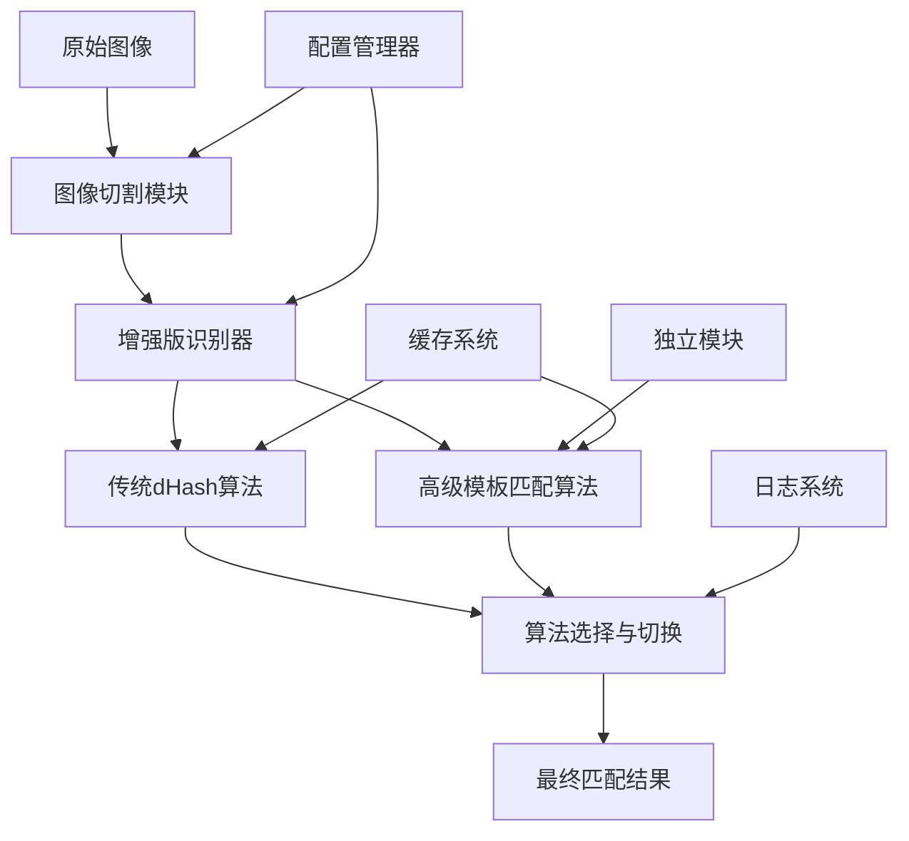

# 游戏装备图像识别系统 - 技术规格文档

## 1. 概述

本文档详细描述了游戏装备图像识别系统的技术规格，包括双重算法架构、增强版识别器、配置管理系统和独立模块的技术实现细节。系统支持传统dHash算法和高级模板匹配算法，提供灵活的算法选择和高精度的装备识别能力。

## 2. 系统架构

### 2.1 整体架构图

```
┌─────────────────────────────────────────────────────────────┐
│                    游戏装备识别系统                          │
├─────────────────────────────────────────────────────────────┤
│  ┌─────────────────┐  ┌─────────────────┐  ┌─────────────────┐ │
│  │   配置管理模块    │  │   图像切割模块    │  │  识别算法模块    │ │
│  │                │  │                │  │                │ │
│  │ • 统一配置管理   │  │ • 固定坐标切割   │  │ • 传统dHash算法  │ │
│  │ • 动态配置更新   │  │ • 轮廓检测切割   │  │ • 高级模板匹配   │ │
│  │ • 配置分类管理   │  │ • 自动模式选择   │  │ • 算法动态切换   │ │
│  │ • 配置持久化    │  │ • 智能筛选      │  │ • 算法对比分析   │ │
│  └─────────────────┘  └─────────────────┘  └─────────────────┘ │
├─────────────────────────────────────────────────────────────┤
│  ┌─────────────────┐  ┌─────────────────┐  ┌─────────────────┐ │
│  │   独立模块系统    │  │   主程序集成      │  │   日志和输出系统  │ │
│  │                │  │                │  │                │ │
│  │ • 高级识别器     │  │ • 批量处理流程   │  │ • 详细日志记录   │ │
│  │ • 插件架构      │  │ • 结果导出      │  │ • 性能监控      │ │
│  │ • 兼容性层      │  │ • 错误处理      │  │ • JSON格式输出  │ │
│  │ • 独立部署     │  │ • 配置集成      │  │ • 缓存管理      │ │
│  └─────────────────┘  └─────────────────┘  └─────────────────┘ │
└─────────────────────────────────────────────────────────────┘
```

### 2.2 双重算法架构

```
┌─────────────────────────────────────────────────────────────┐
│                    双重算法架构                            │
├─────────────────────────────────────────────────────────────┤
│  ┌─────────────────────────────────────────────────────┐   │
│  │              增强版识别器                        │   │
│  │  ┌─────────────────┐  ┌─────────────────┐     │   │
│  │  │   传统dHash算法  │  │   高级模板匹配   │     │   │
│  │  │                │  │                │     │   │
│  │  │ • 快速哈希计算   │  │ • 精确模板匹配   │     │   │
│  │  │ • 汉明距离比较   │  │ • 掩码匹配      │     │   │
│  │  │ • 速度优先      │  │ • 直方图验证    │     │   │
│  │  │ • 批量处理      │  │ • 精度优先      │     │   │
│  │  └─────────────────┘  └─────────────────┘     │   │
│  │                                                 │   │
│  │  ┌─────────────────────────────────────────────┐   │   │
│  │  │            算法选择与切换机制              │   │   │
│  │  │  • 动态算法切换                        │   │   │
│  │  │  • 性能对比分析                        │   │   │
│  │  │  • 向后兼容保证                        │   │   │
│  │  └─────────────────────────────────────────────┘   │   │
│  └─────────────────────────────────────────────────────┘   │
└─────────────────────────────────────────────────────────────┘
```

### 2.2 核心组件关系



## 3. 核心模块设计

### 3.1 增强版识别器 (EnhancedEquipmentRecognizer)

#### 3.1.1 类设计

```python
class EnhancedEquipmentRecognizer(EquipmentRecognizer):
    """增强版装备识别器，支持传统dHash算法和高级模板匹配算法
    
    继承自EquipmentRecognizer类，集成AdvancedEquipmentRecognizer的功能，
    提供算法选择功能，支持在传统dHash算法和高级模板匹配算法之间切换
    """
    
    def __init__(self, default_threshold=80, use_advanced_algorithm=True,
                 enable_masking=True, enable_histogram=True):
        """初始化增强版装备识别器
        
        Args:
            default_threshold: 默认匹配阈值，相似度高于此值视为匹配
            use_advanced_algorithm: 是否使用高级算法，默认为True
            enable_masking: 是否启用掩码匹配（仅高级算法有效）
            enable_histogram: 是否启用直方图验证（仅高级算法有效）
        """
    
    def set_algorithm_mode(self, use_advanced: bool) -> bool:
        """设置算法模式
        
        Args:
            use_advanced: 是否使用高级算法
            
        Returns:
            设置是否成功
        """
    
    def get_algorithm_info(self) -> Dict[str, Any]:
        """获取当前算法信息
        
        Returns:
            包含算法信息的字典
        """
    
    def compare_images(self, image_path1, image_path2, threshold=None):
        """比较两张图像的相似度，根据当前算法模式选择合适的算法
        
        Args:
            image_path1: 第一张图像路径
            image_path2: 第二张图像路径
            threshold: 匹配阈值，若为None则使用默认阈值
            
        Returns:
            (相似度, 是否匹配) 的元组
        """
    
    def recognize_equipment_advanced(self, base_image_path: str, target_image_path: str):
        """使用高级算法识别装备（仅当高级算法可用时）
        
        Args:
            base_image_path: 基准装备图像路径
            target_image_path: 目标图像路径
            
        Returns:
            高级匹配结果，若高级算法不可用则返回None
        """
    
    def batch_recognize(self, base_image_path: str, target_folder: str,
                       threshold: float = None) -> List[Dict[str, Any]]:
        """批量识别装备
        
        Args:
            base_image_path: 基准装备图像路径
            target_folder: 目标图像文件夹
            threshold: 相似度阈值，若为None则使用默认阈值
            
        Returns:
            识别结果列表
        """
```

#### 3.1.2 算法切换机制

```python
def set_algorithm_mode(self, use_advanced: bool) -> bool:
    """设置算法模式"""
    if use_advanced and not ADVANCED_MATCHER_AVAILABLE:
        print("错误: 高级匹配器不可用")
        return False
        
    if use_advanced and self.advanced_recognizer is None:
        print("错误: 高级识别器未初始化")
        return False
        
    self.use_advanced_algorithm = use_advanced
    print(f"算法模式已切换为: {'高级模板匹配' if use_advanced else '传统dHash'}")
    return True

def get_algorithm_info(self) -> Dict[str, Any]:
    """获取当前算法信息"""
    info = {
        'current_algorithm': 'advanced' if self.use_advanced_algorithm else 'traditional',
        'advanced_available': ADVANCED_MATCHER_AVAILABLE,
        'advanced_initialized': self.advanced_recognizer is not None,
        'default_threshold': self.default_threshold
    }
    
    if self.advanced_recognizer is not None:
        info.update({
            'masking_enabled': self.advanced_recognizer.enable_masking,
            'histogram_enabled': self.advanced_recognizer.enable_histogram,
            'item_max_size': self.advanced_recognizer.item_max_size
        })
    
    return info
```

### 3.2 配置管理模块 (ConfigManager)

#### 3.2.1 类设计

```python
class ConfigManager:
    """配置管理器，负责加载和管理系统配置"""
    
    def __init__(self, config_path: str = "config.json"):
        """初始化配置管理器
        
        Args:
            config_path: 配置文件路径，默认为项目根目录下的config.json
        """
    
    def _load_config(self) -> Dict[str, Any]:
        """加载配置文件
        
        Returns:
            配置字典，如果文件不存在则返回默认配置
        """
    
    def _merge_configs(self, default: Dict[str, Any], loaded: Dict[str, Any]) -> Dict[str, Any]:
        """合并配置字典，保留默认值中不存在于加载配置中的项
        
        Args:
            default: 默认配置
            loaded: 加载的配置
            
        Returns:
            合并后的配置
        """
    
    def _save_config(self, config: Dict[str, Any]) -> None:
        """保存配置到文件
        
        Args:
            config: 要保存的配置字典
        """
    
    def get_recognition_config(self) -> Dict[str, Any]:
        """获取识别相关配置
        
        Returns:
            识别配置字典
        """
    
    def get_cutting_config(self) -> Dict[str, Any]:
        """获取切割相关配置
        
        Returns:
            切割配置字典
        """
    
    def get_paths_config(self) -> Dict[str, Any]:
        """获取路径相关配置
        
        Returns:
            路径配置字典
        """
    
    def update_recognition_config(self, **kwargs) -> None:
        """更新识别配置
        
        Args:
            **kwargs: 要更新的配置项
        """
    
    def get_algorithm_mode(self) -> bool:
        """获取算法模式
        
        Returns:
            True表示使用高级算法，False表示使用传统算法
        """
    
    def set_algorithm_mode(self, use_advanced: bool) -> None:
        """设置算法模式
        
        Args:
            use_advanced: True表示使用高级算法，False表示使用传统算法
        """
    
    def print_config_summary(self) -> None:
        """打印配置摘要"""
```

#### 3.2.2 配置文件结构

```json
{
  "recognition": {
    "default_threshold": 80,
    "use_advanced_algorithm": true,
    "enable_masking": true,
    "enable_histogram": true,
    "algorithm_description": "高级模板匹配算法提供更精确的装备识别，传统dHash算法提供更快的处理速度"
  },
  "cutting": {
    "default_method": "fixed",
    "fixed_grid": [6, 2],
    "fixed_item_width": 100,
    "fixed_item_height": 120,
    "fixed_margin_left": 20,
    "fixed_margin_top": 350,
    "contour_min_area": 800,
    "contour_max_area": 50000
  },
  "paths": {
    "images_dir": "images",
    "base_equipment_dir": "base_equipment",
    "game_screenshots_dir": "game_screenshots",
    "cropped_equipment_dir": "cropped_equipment",
    "logs_dir": "recognition_logs"
  },
  "logging": {
    "enable_logging": true,
    "log_level": "INFO",
    "include_algorithm_info": true,
    "include_performance_metrics": true
  },
  "performance": {
    "enable_caching": true,
    "cache_size": 100,
    "parallel_processing": false,
    "max_workers": 4
  },
  "ui": {
    "show_algorithm_selection": true,
    "show_performance_info": true,
    "show_detailed_results": true
  }
}
```

### 3.3 独立模块系统 (Standalone Modules)

#### 3.3.1 高级装备识别器 (AdvancedEquipmentRecognizer)

```python
class AdvancedEquipmentRecognizer:
    """高级装备识别器
    
    独立实现模板匹配与辅助验证机制结合的识别方法
    """
    
    def __init__(self, enable_masking=True, enable_histogram=True):
        """初始化高级装备识别器
        
        Args:
            enable_masking: 是否启用掩码匹配
            enable_histogram: 是否启用直方图验证
        """
    
    def preprocess_image(self, image_path: str, target_size: Tuple[int, int] = None,
                       remove_background: bool = False) -> np.ndarray:
        """预处理图像：标准化尺寸和格式
        
        Args:
            image_path: 图像路径
            target_size: 目标尺寸，默认使用标准尺寸
            remove_background: 是否移除背景色（默认False，保留颜色信息）
            
        Returns:
            预处理后的图像数组（保留RGB颜色）
        """
    
    def calc_color_similarity(self, img1: np.ndarray, img2: np.ndarray) -> float:
        """计算两个图像的颜色相似度（保留RGB信息）
        
        Args:
            img1: 第一个图像（RGB）
            img2: 第二个图像（RGB）
            
        Returns:
            颜色相似度（0-1，1表示完全相同）
        """
    
    def create_mask(self, image: np.ndarray, threshold: int = 200) -> np.ndarray:
        """创建图像掩码（支持RGB和灰度图）
        
        Args:
            image: 输入图像
            threshold: 阈值
            
        Returns:
            掩码数组
        """
    
    def template_match(self, template: np.ndarray, target: np.ndarray,
                     mask: np.ndarray = None) -> Tuple[float, Tuple[int, int]]:
        """执行模板匹配（支持RGB图像）
        
        Args:
            template: 模板图像
            target: 目标图像
            mask: 可选的掩码
            
        Returns:
            (匹配值, 匹配位置) 的元组
        """
    
    def recognize_equipment(self, base_image_path: str, target_image_path: str) -> AdvancedMatchResult:
        """识别装备
        
        Args:
            base_image_path: 基准装备图像路径
            target_image_path: 目标图像路径
            
        Returns:
            识别结果
        """
    
    def batch_recognize(self, base_image_path: str, target_folder: str,
                       threshold: float = 60.0) -> List[AdvancedMatchResult]:
        """批量识别装备
        
        Args:
            base_image_path: 基准装备图像路径
            target_folder: 目标图像文件夹
            threshold: 相似度阈值
            
        Returns:
            识别结果列表
        """
```

#### 3.3.2 高级匹配结果数据结构

```python
@dataclass
class AdvancedMatchResult:
    """高级匹配结果数据类"""
    item_name: str
    item_base: str
    matched_by: MatchedBy
    min_val: float
    hist_val: float
    similarity: float
    confidence: float
    template: Optional[ItemTemplate] = None
    location: Optional[Tuple[int, int]] = None

class MatchedBy(Enum):
    """匹配方式枚举"""
    TEMPLATE_MATCH = 0
    HISTOGRAM_MATCH = 1
    ONLY_UNIQUE_FOR_BASE = 2
    ITEM_NAME = 3
    SOLARIS_CIRCLET = 4
```

### 3.4 图像预处理模块 (ImagePreprocessor)

#### 3.1.1 类设计

```python
class ImagePreprocessor:
    """图像预处理模块，负责装备图像的标准化和变体生成"""
    
    def __init__(self, item_max_size=(104, 208)):
        self.item_max_size = item_max_size
        self.socket_variants_cache = {}
    
    def preprocess_base_image(self, image_path: str) -> np.ndarray:
        """预处理基准装备图像
        
        Args:
            image_path: 基准装备图像路径
            
        Returns:
            预处理后的图像数组
        """
    
    def preprocess_target_image(self, image_path: str) -> np.ndarray:
        """预处理目标装备图像
        
        Args:
            image_path: 目标装备图像路径
            
        Returns:
            预处理后的图像数组
        """
    
    def generate_socket_variants(self, base_image: np.ndarray, 
                               socket_counts: List[int] = [0, 1, 2, 3, 4, 5, 6]) -> Dict[int, np.ndarray]:
        """生成不同socket数量的装备变体模板
        
        Args:
            base_image: 基准装备图像
            socket_counts: 需要生成的socket数量列表
            
        Returns:
            socket数量到变体图像的映射字典
        """
    
    def create_socket_mask(self, image_shape: Tuple[int, int], 
                          socket_positions: List[Tuple[int, int]]) -> np.ndarray:
        """创建socket位置的掩码
        
        Args:
            image_shape: 图像形状 (height, width)
            socket_positions: socket位置列表
            
        Returns:
            socket掩码数组
        """
```

#### 3.1.2 实现细节

```python
def preprocess_base_image(self, image_path: str) -> np.ndarray:
    """预处理基准装备图像"""
    try:
        # 1. 加载图像
        image = cv2.imread(image_path)
        if image is None:
            raise ValueError(f"无法加载图像: {image_path}")
        
        # 2. 转换为灰度图
        gray_image = cv2.cvtColor(image, cv2.COLOR_BGR2GRAY)
        
        # 3. 调整尺寸至标准大小
        resized_image = cv2.resize(gray_image, self.item_max_size, 
                                  interpolation=cv2.INTER_AREA)
        
        # 4. 应用高斯模糊减少噪声
        blurred_image = cv2.GaussianBlur(resized_image, (3, 3), 0)
        
        return blurred_image
        
    except Exception as e:
        print(f"图像预处理出错: {e}")
        return None

def generate_socket_variants(self, base_image: np.ndarray, 
                           socket_counts: List[int] = [0, 1, 2, 3, 4, 5, 6]) -> Dict[int, np.ndarray]:
    """生成不同socket数量的装备变体模板"""
    variants = {}
    
    # 缓存检查
    cache_key = hash(base_image.tobytes())
    if cache_key in self.socket_variants_cache:
        return self.socket_variants_cache[cache_key]
    
    for socket_count in socket_counts:
        variant = base_image.copy()
        
        # 在装备底部添加socket图标
        if socket_count > 0:
            socket_size = 8
            socket_spacing = 12
            start_x = (self.item_max_size[0] - (socket_count * socket_spacing + (socket_count - 1) * 2)) // 2
            socket_y = self.item_max_size[1] - 15
            
            for i in range(socket_count):
                socket_x = start_x + i * (socket_spacing + 2)
                # 绘制圆形socket
                cv2.circle(variant, (socket_x, socket_y), socket_size // 2, 255, -1)
                cv2.circle(variant, (socket_x, socket_y), socket_size // 2, 0, 1)
        
        variants[socket_count] = variant
    
    # 缓存结果
    self.socket_variants_cache[cache_key] = variants
    return variants
```

### 3.2 模板匹配模块 (TemplateMatcher)

#### 3.2.1 类设计

```python
class TemplateMatcher:
    """模板匹配模块，负责高精度的装备匹配"""
    
    def __init__(self, opt_use_mask=True, exclude_masking=None):
        self.opt_use_mask = opt_use_mask
        self.exclude_masking = exclude_masking or []
        self.template_cache = {}
    
    def get_mask(self, image: np.ndarray, equipment_type: str = None) -> np.ndarray:
        """生成装备轮廓掩码
        
        Args:
            image: 输入图像
            equipment_type: 装备类型，用于判断是否排除掩码
            
        Returns:
            装备轮廓掩码
        """
    
    def match_template(self, template: np.ndarray, target: np.ndarray, 
                      mask: np.ndarray = None) -> Tuple[float, Tuple[int, int]]:
        """执行模板匹配
        
        Args:
            template: 模板图像
            target: 目标图像
            mask: 可选的掩码
            
        Returns:
            (匹配值, 匹配位置) 的元组
        """
    
    def check_one_template(self, template_variants: Dict[int, np.ndarray], 
                          target: np.ndarray) -> List[MatchResult]:
        """检查单个模板的所有变体
        
        Args:
            template_variants: 模板变体字典
            target: 目标图像
            
        Returns:
            匹配结果列表
        """
```

#### 3.2.2 实现细节

```python
def get_mask(self, image: np.ndarray, equipment_type: str = None) -> np.ndarray:
    """生成装备轮廓掩码"""
    if not self.opt_use_mask or equipment_type in self.exclude_masking:
        return None
    
    # 1. 应用自适应阈值
    binary = cv2.adaptiveThreshold(
        image, 255, cv2.ADAPTIVE_THRESH_GAUSSIAN_C, 
        cv2.THRESH_BINARY_INV, 11, 2
    )
    
    # 2. 查找轮廓
    contours, _ = cv2.findContours(binary, cv2.RETR_EXTERNAL, cv2.CHAIN_APPROX_SIMPLE)
    
    # 3. 筛选最大轮廓（假设装备是最大物体）
    if contours:
        largest_contour = max(contours, key=cv2.contourArea)
        mask = np.zeros_like(image)
        cv2.fillPoly(mask, [largest_contour], 255)
        return mask
    
    return None

def match_template(self, template: np.ndarray, target: np.ndarray, 
                  mask: np.ndarray = None) -> Tuple[float, Tuple[int, int]]:
    """执行模板匹配"""
    # 使用TM_SQDIFF_NORMED算法，值越小表示匹配度越高
    if mask is not None:
        result = cv2.matchTemplate(target, template, cv2.TM_SQDIFF_NORMED, mask=mask)
    else:
        result = cv2.matchTemplate(target, template, cv2.TM_SQDIFF_NORMED)
    
    # 找到最佳匹配位置
    min_val, max_val, min_loc, max_loc = cv2.minMaxLoc(result)
    
    return min_val, min_loc

def check_one_template(self, template_variants: Dict[int, np.ndarray], 
                      target: np.ndarray) -> List[MatchResult]:
    """检查单个模板的所有变体"""
    results = []
    
    for socket_count, template in template_variants.items():
        # 生成掩码
        mask = self.get_mask(template)
        
        # 执行匹配
        match_val, match_loc = self.match_template(template, target, mask)
        
        # 创建匹配结果
        result = MatchResult(
            socket_count=socket_count,
            match_value=match_val,
            match_location=match_loc,
            template=template,
            mask=mask
        )
        
        results.append(result)
    
    return results
```

### 3.3 辅助验证模块 (HistogramMatcher)

#### 3.3.1 类设计

```python
class HistogramMatcher:
    """直方图匹配模块，提供颜色分布验证"""
    
    def __init__(self, hist_bins=32, hist_range=(0, 256)):
        self.hist_bins = hist_bins
        self.hist_range = hist_range
    
    def calc_normalized_histogram(self, image: np.ndarray) -> np.ndarray:
        """计算归一化直方图
        
        Args:
            image: 输入图像
            
        Returns:
            归一化直方图
        """
    
    def compare_histograms(self, hist1: np.ndarray, hist2: np.ndarray) -> float:
        """比较两个直方图的相似度
        
        Args:
            hist1: 第一个直方图
            hist2: 第二个直方图
            
        Returns:
            巴氏距离（越小越相似）
        """
    
    def verify_match(self, template: np.ndarray, target: np.ndarray, 
                    match_region: Tuple[int, int, int, int]) -> float:
        """验证匹配区域
        
        Args:
            template: 模板图像
            target: 目标图像
            match_region: 匹配区域 (x, y, width, height)
            
        Returns:
            验证得分
        """
```

#### 3.3.2 实现细节

```python
def calc_normalized_histogram(self, image: np.ndarray) -> np.ndarray:
    """计算归一化直方图"""
    # 计算直方图
    hist = cv2.calcHist([image], [0], None, [self.hist_bins], self.hist_range)
    
    # 归一化
    cv2.normalize(hist, hist, alpha=0, beta=1, norm_type=cv2.NORM_MINMAX)
    
    return hist.flatten()

def compare_histograms(self, hist1: np.ndarray, hist2: np.ndarray) -> float:
    """比较两个直方图的相似度"""
    # 使用巴氏距离比较直方图
    distance = cv2.compareHist(hist1, hist2, cv2.HISTCMP_BHATTACHARYYA)
    return distance

def verify_match(self, template: np.ndarray, target: np.ndarray, 
                match_region: Tuple[int, int, int, int]) -> float:
    """验证匹配区域"""
    x, y, w, h = match_region
    
    # 提取匹配区域
    if x + w <= target.shape[1] and y + h <= target.shape[0]:
        target_region = target[y:y+h, x:x+w]
        
        # 调整尺寸以匹配模板
        if target_region.shape != template.shape:
            target_region = cv2.resize(target_region, (template.shape[1], template.shape[0]))
        
        # 计算直方图
        template_hist = self.calc_normalized_histogram(template)
        target_hist = self.calc_normalized_histogram(target_region)
        
        # 返回巴氏距离
        return self.compare_histograms(template_hist, target_hist)
    
    return 1.0  # 最大距离（不匹配）
```

### 3.4 数据模型

#### 3.4.1 匹配结果类

```python
@dataclass
class MatchResult:
    """匹配结果数据类"""
    socket_count: int
    match_value: float
    match_location: Tuple[int, int]
    template: np.ndarray
    mask: np.ndarray = None
    histogram_distance: float = None
    combined_score: float = None
    
    def __post_init__(self):
        """后处理，计算综合得分"""
        # 将匹配值转换为相似度（0-100）
        self.similarity = max(0, (1 - self.match_value) * 100)
        
        # 如果有直方图距离，计算综合得分
        if self.histogram_distance is not None:
            # 综合得分：70%模板匹配 + 30%直方图匹配
            self.combined_score = self.similarity * 0.7 + (1 - self.histogram_distance) * 100 * 0.3
        else:
            self.combined_score = self.similarity
```

#### 3.4.2 装备信息类

```python
@dataclass
class EquipmentInfo:
    """装备信息数据类"""
    equipment_id: str
    equipment_name: str
    equipment_type: str
    socket_count: int
    base_image_path: str
    variants: Dict[int, np.ndarray] = None
    mask: np.ndarray = None
    special_handler: str = None  # 特殊处理插件名称
```

## 4. 插件系统设计

### 4.1 插件基类

```python
class EquipmentMatcherPlugin:
    """装备匹配插件基类"""
    
    def __init__(self, name: str):
        self.name = name
    
    def can_handle(self, equipment_info: EquipmentInfo) -> bool:
        """判断是否可以处理该装备
        
        Args:
            equipment_info: 装备信息
            
        Returns:
            是否可以处理
        """
        return False
    
    def match(self, template_variants: Dict[int, np.ndarray], 
              target: np.ndarray) -> List[MatchResult]:
        """执行匹配
        
        Args:
            template_variants: 模板变体字典
            target: 目标图像
            
        Returns:
            匹配结果列表
        """
        return []
    
    def get_priority(self) -> int:
        """获取插件优先级，数值越高优先级越高"""
        return 0
```

### 4.2 特殊装备插件示例

#### 4.2.1 SolarisCircletMatcher

```python
class SolarisCircletMatcher(EquipmentMatcherPlugin):
    """Solaris头冠特殊匹配器，基于宝石颜色区分同类装备"""
    
    def __init__(self):
        super().__init__("SolarisCircletMatcher")
        self.gem_colors = {
            'red': ((0, 0, 200), (50, 50, 255)),    # 红色宝石HSV范围
            'blue': ((100, 0, 200), (130, 50, 255)), # 蓝色宝石HSV范围
            'green': ((40, 0, 200), (80, 50, 255)),  # 绿色宝石HSV范围
            'white': ((0, 0, 200), (180, 30, 255))   # 白色宝石HSV范围
        }
    
    def can_handle(self, equipment_info: EquipmentInfo) -> bool:
        """判断是否为Solaris头冠"""
        return 'solaris' in equipment_info.equipment_name.lower() and \
               'circlet' in equipment_info.equipment_name.lower()
    
    def match(self, template_variants: Dict[int, np.ndarray], 
              target: np.ndarray) -> List[MatchResult]:
        """基于宝石颜色进行匹配"""
        results = []
        
        for socket_count, template in template_variants.items():
            # 检测模板中的宝石颜色
            template_gems = self.detect_gem_colors(template)
            
            # 在目标图像中搜索相同颜色组合
            target_gems = self.detect_gem_colors(target)
            
            # 计算颜色匹配度
            color_match_score = self.calculate_color_match(template_gems, target_gems)
            
            # 如果颜色匹配度高，进行模板匹配
            if color_match_score > 0.7:
                match_val, match_loc = cv2.matchTemplate(
                    target, template, cv2.TM_SQDIFF_NORMED
                )
                
                result = MatchResult(
                    socket_count=socket_count,
                    match_value=match_val,
                    match_location=match_loc,
                    template=template,
                    combined_score=color_match_score * 100
                )
                results.append(result)
        
        return results
    
    def detect_gem_colors(self, image: np.ndarray) -> List[str]:
        """检测图像中的宝石颜色"""
        # 转换为HSV颜色空间
        hsv = cv2.cvtColor(image, cv2.COLOR_GRAY2BGR)
        hsv = cv2.cvtColor(hsv, cv2.COLOR_BGR2HSV)
        
        detected_colors = []
        
        for color_name, (lower, upper) in self.gem_colors.items():
            # 创建颜色掩码
            mask = cv2.inRange(hsv, np.array(lower), np.array(upper))
            
            # 检查是否有足够的像素
            if cv2.countNonZero(mask) > 50:
                detected_colors.append(color_name)
        
        return detected_colors
    
    def calculate_color_match(self, template_colors: List[str], 
                            target_colors: List[str]) -> float:
        """计算颜色匹配度"""
        if not template_colors:
            return 0.0
        
        # 计算交集
        common_colors = set(template_colors) & set(target_colors)
        
        # 计算匹配度
        match_score = len(common_colors) / len(template_colors)
        return match_score
```

#### 4.2.2 HistogramMatcher

```python
class HistogramMatcher(EquipmentMatcherPlugin):
    """强制使用直方图匹配的插件"""
    
    def __init__(self):
        super().__init__("HistogramMatcher")
        self.hist_matcher = HistogramMatcher()
    
    def can_handle(self, equipment_info: EquipmentInfo) -> bool:
        """判断是否需要强制使用直方图匹配"""
        # 可以根据装备类型、名称等条件判断
        force_hist_types = ['ring', 'amulet', 'charm']
        return any(eq_type in equipment_info.equipment_type.lower() 
                  for eq_type in force_hist_types)
    
    def match(self, template_variants: Dict[int, np.ndarray], 
              target: np.ndarray) -> List[MatchResult]:
        """使用直方图匹配"""
        results = []
        
        for socket_count, template in template_variants.items():
            # 计算整个图像的直方图相似度
            template_hist = self.hist_matcher.calc_normalized_histogram(template)
            target_hist = self.hist_matcher.calc_normalized_histogram(target)
            
            hist_distance = self.hist_matcher.compare_histograms(
                template_hist, target_hist
            )
            
            # 转换为相似度得分
            similarity = (1 - hist_distance) * 100
            
            result = MatchResult(
                socket_count=socket_count,
                match_value=hist_distance,  # 使用直方图距离作为匹配值
                match_location=(0, 0),       # 直方图匹配不提供位置信息
                template=template,
                histogram_distance=hist_distance,
                combined_score=similarity
            )
            results.append(result)
        
        return results
    
    def get_priority(self) -> int:
        """高优先级，优先使用直方图匹配"""
        return 10
```

## 5. 智能决策引擎

### 5.1 决策引擎类设计

```python
class IntelligentMatchingEngine:
    """智能匹配决策引擎"""
    
    def __init__(self, threshold_result_distance=0.05):
        self.threshold_result_distance = threshold_result_distance
        self.plugins = []
        self.dhash_matcher = EquipmentRecognizer()  # 兼容性
    
    def register_plugin(self, plugin: EquipmentMatcherPlugin):
        """注册插件"""
        self.plugins.append(plugin)
        # 按优先级排序
        self.plugins.sort(key=lambda p: p.get_priority(), reverse=True)
    
    def intelligent_match(self, equipment_info: EquipmentInfo, 
                         target_image: np.ndarray) -> Optional[MatchResult]:
        """执行智能匹配
        
        Args:
            equipment_info: 装备信息
            target_image: 目标图像
            
        Returns:
            最佳匹配结果
        """
        # 第一层：dHash快速筛选
        dhash_result = self.quick_dhash_check(equipment_info, target_image)
        if dhash_result and dhash_result.similarity > 90:
            return dhash_result
        
        # 第二层：检查是否有特殊插件可以处理
        for plugin in self.plugins:
            if plugin.can_handle(equipment_info):
                plugin_results = plugin.match(
                    equipment_info.variants, target_image
                )
                if plugin_results:
                    return self.get_best_result(plugin_results)
        
        # 第三层：标准模板匹配+直方图验证
        standard_results = self.standard_template_match(equipment_info, target_image)
        
        # 第四层：结果筛选和决策
        return self.get_best_result(standard_results)
    
    def get_best_result(self, results: List[MatchResult]) -> Optional[MatchResult]:
        """从匹配结果中筛选最佳结果
        
        Args:
            results: 匹配结果列表
            
        Returns:
            最佳匹配结果
        """
        if not results:
            return None
        
        # 按综合得分排序
        results.sort(key=lambda r: r.combined_score, reverse=True)
        
        # 检查最佳结果与次佳结果的差异
        if len(results) > 1:
            best_score = results[0].combined_score
            second_best_score = results[1].combined_score
            score_difference = best_score - second_best_score
            
            # 如果差异过小，认为无法确定
            if score_difference < self.threshold_result_distance * 100:
                return None
        
        return results[0]
```

## 6. 高级装备识别器

### 6.1 主类设计

```python
class AdvancedEquipmentRecognizer:
    """高级装备识别器，整合所有识别功能"""
    
    def __init__(self, config: dict = None):
        # 配置参数
        self.config = config or self.get_default_config()
        
        # 初始化组件
        self.preprocessor = ImagePreprocessor(
            item_max_size=self.config['ITEM_MAX_SIZE']
        )
        self.template_matcher = TemplateMatcher(
            opt_use_mask=self.config['OPT_USE_MASK'],
            exclude_masking=self.config['EXCLUDE_MASKING']
        )
        self.histogram_matcher = HistogramMatcher()
        self.matching_engine = IntelligentMatchingEngine(
            threshold_result_distance=self.config['THRESHOLD_RESULT_DISTANCE']
        )
        
        # 装备数据库
        self.equipment_database = {}
        
        # 注册默认插件
        self.register_default_plugins()
    
    def get_default_config(self) -> dict:
        """获取默认配置"""
        return {
            'ITEM_MAX_SIZE': (104, 208),
            'OPT_USE_MASK': True,
            'EXCLUDE_MASKING': [],
            'THRESHOLD_RESULT_DISTANCE': 0.05,
            'DHASH_THRESHOLD': 80
        }
    
    def register_default_plugins(self):
        """注册默认插件"""
        self.matching_engine.register_plugin(SolarisCircletMatcher())
        self.matching_engine.register_plugin(HistogramMatcher())
    
    def load_equipment_database(self, database_path: str):
        """加载装备数据库"""
        # 实现装备数据库加载逻辑
        pass
    
    def add_equipment_template(self, equipment_info: EquipmentInfo):
        """添加装备模板"""
        # 预处理基准图像
        base_image = self.preprocessor.preprocess_base_image(
            equipment_info.base_image_path
        )
        
        # 生成变体
        variants = self.preprocessor.generate_socket_variants(base_image)
        equipment_info.variants = variants
        
        # 生成掩码
        equipment_info.mask = self.template_matcher.get_mask(
            base_image, equipment_info.equipment_type
        )
        
        # 添加到数据库
        self.equipment_database[equipment_info.equipment_id] = equipment_info
    
    def recognize_equipment(self, target_image_path: str) -> List[Tuple[str, float]]:
        """识别目标图像中的装备
        
        Args:
            target_image_path: 目标图像路径
            
        Returns:
            识别结果列表 [(equipment_id, confidence), ...]
        """
        # 预处理目标图像
        target_image = self.preprocessor.preprocess_target_image(target_image_path)
        if target_image is None:
            return []
        
        results = []
        
        # 对数据库中的每个装备进行匹配
        for equipment_id, equipment_info in self.equipment_database.items():
            match_result = self.matching_engine.intelligent_match(
                equipment_info, target_image
            )
            
            if match_result and match_result.combined_score > self.config['DHASH_THRESHOLD']:
                results.append((equipment_id, match_result.combined_score))
        
        # 按置信度排序
        results.sort(key=lambda x: x[1], reverse=True)
        
        return results
```

## 7. 集成方案

### 7.1 与现有系统的集成

#### 7.1.1 兼容性适配器

```python
class CompatibilityAdapter:
    """兼容性适配器，确保新系统与现有代码兼容"""
    
    def __init__(self, use_advanced=True):
        self.use_advanced = use_advanced
        if use_advanced:
            self.recognizer = AdvancedEquipmentRecognizer()
        else:
            self.recognizer = EquipmentRecognizer()
    
    def compare_images(self, image_path1: str, image_path2: str, 
                      threshold: int = None) -> Tuple[float, bool]:
        """兼容现有API的图像比较方法"""
        if self.use_advanced:
            # 使用高级识别器
            results = self.recognizer.recognize_equipment(image_path2)
            if results:
                return results[0][1], True
            else:
                return 0.0, False
        else:
            # 使用原有dHash识别器
            return self.recognizer.compare_images(image_path1, image_path2, threshold)
```

#### 7.1.2 渐进式迁移策略

```python
class MigrationManager:
    """迁移管理器，控制渐进式迁移过程"""
    
    def __init__(self):
        self.adapter = CompatibilityAdapter(use_advanced=False)
        self.advanced_adapter = CompatibilityAdapter(use_advanced=True)
        self.migration_stats = {
            'total_comparisons': 0,
            'advanced_matches': 0,
            'traditional_matches': 0,
            'agreement_rate': 0
        }
    
    def compare_with_migration(self, image_path1: str, image_path2: str, 
                            threshold: int = None) -> Tuple[float, bool]:
        """带迁移统计的图像比较"""
        # 同时使用两种方法
        traditional_result = self.adapter.compare_images(image_path1, image_path2, threshold)
        advanced_result = self.advanced_adapter.compare_images(image_path1, image_path2, threshold)
        
        # 更新统计
        self.migration_stats['total_comparisons'] += 1
        
        if traditional_result[1]:
            self.migration_stats['traditional_matches'] += 1
        
        if advanced_result[1]:
            self.migration_stats['advanced_matches'] += 1
        
        # 计算一致性
        if traditional_result[1] == advanced_result[1]:
            self.migration_stats['agreement_rate'] += 1
        
        # 返回传统结果（保持兼容性）
        return traditional_result
    
    def get_migration_report(self) -> dict:
        """获取迁移报告"""
        total = self.migration_stats['total_comparisons']
        if total == 0:
            return self.migration_stats
        
        report = self.migration_stats.copy()
        report['agreement_rate'] = (report['agreement_rate'] / total) * 100
        report['advanced_improvement'] = (
            (report['advanced_matches'] - report['traditional_matches']) / total
        ) * 100
        
        return report
```

## 8. 性能优化

### 8.1 缓存策略

```python
class CacheManager:
    """缓存管理器"""
    
    def __init__(self, max_cache_size=1000):
        self.max_cache_size = max_cache_size
        self.template_cache = {}
        self.histogram_cache = {}
        self.mask_cache = {}
        self.access_order = []
    
    def get_cached_template(self, image_path: str, socket_count: int) -> Optional[np.ndarray]:
        """获取缓存的模板"""
        key = (image_path, socket_count)
        if key in self.template_cache:
            self._update_access_order(key)
            return self.template_cache[key]
        return None
    
    def cache_template(self, image_path: str, socket_count: int, template: np.ndarray):
        """缓存模板"""
        key = (image_path, socket_count)
        
        # 检查缓存大小
        if len(self.template_cache) >= self.max_cache_size:
            self._evict_oldest()
        
        self.template_cache[key] = template
        self._update_access_order(key)
    
    def _update_access_order(self, key):
        """更新访问顺序"""
        if key in self.access_order:
            self.access_order.remove(key)
        self.access_order.append(key)
    
    def _evict_oldest(self):
        """淘汰最旧的缓存项"""
        if self.access_order:
            oldest_key = self.access_order.pop(0)
            self.template_cache.pop(oldest_key, None)
            self.histogram_cache.pop(oldest_key, None)
            self.mask_cache.pop(oldest_key, None)
```

### 8.2 并行处理

```python
import concurrent.futures
from multiprocessing import Pool

class ParallelProcessor:
    """并行处理器"""
    
    def __init__(self, max_workers=None):
        self.max_workers = max_workers or os.cpu_count()
    
    def parallel_match(self, equipment_database: dict, 
                      target_image: np.ndarray) -> List[Tuple[str, float]]:
        """并行匹配多个装备"""
        results = []
        
        with concurrent.futures.ThreadPoolExecutor(max_workers=self.max_workers) as executor:
            # 提交所有匹配任务
            future_to_equipment = {
                executor.submit(self._match_single_equipment, equipment_id, equipment_info, target_image): equipment_id
                for equipment_id, equipment_info in equipment_database.items()
            }
            
            # 收集结果
            for future in concurrent.futures.as_completed(future_to_equipment):
                equipment_id = future_to_equipment[future]
                try:
                    result = future.result()
                    if result:
                        results.append(result)
                except Exception as exc:
                    print(f'装备 {equipment_id} 匹配时出错: {exc}')
        
        return results
    
    def _match_single_equipment(self, equipment_id: str, equipment_info: EquipmentInfo, 
                               target_image: np.ndarray) -> Optional[Tuple[str, float]]:
        """匹配单个装备"""
        # 这里实现单个装备的匹配逻辑
        # 返回 (equipment_id, confidence) 或 None
        pass
```

## 9. 配置管理

### 9.1 配置文件格式

```json
{
    "recognition_config": {
        "ITEM_MAX_SIZE": [104, 208],
        "OPT_USE_MASK": true,
        "EXCLUDE_MASKING": ["weapon", "shield"],
        "THRESHOLD_RESULT_DISTANCE": 0.05,
        "DHASH_THRESHOLD": 80,
        "HISTOGRAM_WEIGHT": 0.3,
        "TEMPLATE_WEIGHT": 0.7
    },
    "performance_config": {
        "ENABLE_CACHING": true,
        "MAX_CACHE_SIZE": 1000,
        "ENABLE_PARALLEL": true,
        "MAX_WORKERS": 4
    },
    "plugin_config": {
        "ENABLE_SOLARIS_MATCHER": true,
        "ENABLE_HISTOGRAM_MATCHER": true,
        "CUSTOM_PLUGINS": []
    },
    "migration_config": {
        "ENABLE_MIGRATION_MODE": true,
        "LOG_MIGRATION_STATS": true,
        "AUTO_SWITCH_THRESHOLD": 0.95
    }
}
```

### 9.2 配置管理器

```python
class ConfigManager:
    """配置管理器"""
    
    def __init__(self, config_path: str = "config.json"):
        self.config_path = config_path
        self.config = self.load_config()
    
    def load_config(self) -> dict:
        """加载配置文件"""
        try:
            with open(self.config_path, 'r', encoding='utf-8') as f:
                return json.load(f)
        except FileNotFoundError:
            print(f"配置文件 {self.config_path} 不存在，使用默认配置")
            return self.get_default_config()
        except json.JSONDecodeError as e:
            print(f"配置文件格式错误: {e}，使用默认配置")
            return self.get_default_config()
    
    def get_default_config(self) -> dict:
        """获取默认配置"""
        return {
            "recognition_config": {
                "ITEM_MAX_SIZE": [104, 208],
                "OPT_USE_MASK": True,
                "EXCLUDE_MASKING": [],
                "THRESHOLD_RESULT_DISTANCE": 0.05,
                "DHASH_THRESHOLD": 80
            },
            "performance_config": {
                "ENABLE_CACHING": True,
                "MAX_CACHE_SIZE": 1000,
                "ENABLE_PARALLEL": True,
                "MAX_WORKERS": None
            },
            "plugin_config": {
                "ENABLE_SOLARIS_MATCHER": True,
                "ENABLE_HISTOGRAM_MATCHER": True,
                "CUSTOM_PLUGINS": []
            }
        }
    
    def save_config(self):
        """保存配置到文件"""
        try:
            with open(self.config_path, 'w', encoding='utf-8') as f:
                json.dump(self.config, f, indent=2, ensure_ascii=False)
        except Exception as e:
            print(f"保存配置文件失败: {e}")
    
    def get(self, key_path: str, default=None):
        """获取配置值
        
        Args:
            key_path: 配置键路径，如 "recognition_config.ITEM_MAX_SIZE"
            default: 默认值
            
        Returns:
            配置值
        """
        keys = key_path.split('.')
        value = self.config
        
        try:
            for key in keys:
                value = value[key]
            return value
        except (KeyError, TypeError):
            return default
```

## 10. 测试策略

### 10.1 单元测试

```python
import unittest
import numpy as np
import cv2

class TestAdvancedEquipmentRecognizer(unittest.TestCase):
    """高级装备识别器单元测试"""
    
    def setUp(self):
        """测试前准备"""
        self.recognizer = AdvancedEquipmentRecognizer()
        self.test_equipment_info = EquipmentInfo(
            equipment_id="test_sword",
            equipment_name="Test Sword",
            equipment_type="weapon",
            socket_count=0,
            base_image_path="test_images/test_sword.png"
        )
    
    def test_image_preprocessing(self):
        """测试图像预处理"""
        # 创建测试图像
        test_image = np.zeros((100, 100), dtype=np.uint8)
        cv2.rectangle(test_image, (10, 10), (90, 90), 255, -1)
        
        # 保存测试图像
        cv2.imwrite("temp_test_image.png", test_image)
        
        # 测试预处理
        preprocessed = self.recognizer.preprocessor.preprocess_base_image("temp_test_image.png")
        
        # 验证结果
        self.assertIsNotNone(preprocessed)
        self.assertEqual(preprocessed.shape, self.recognizer.config['ITEM_MAX_SIZE'])
        
        # 清理
        os.remove("temp_test_image.png")
    
    def test_socket_variants_generation(self):
        """测试socket变体生成"""
        base_image = np.zeros((104, 208), dtype=np.uint8)
        cv2.rectangle(base_image, (10, 10), (94, 198), 255, -1)
        
        variants = self.recognizer.preprocessor.generate_socket_variants(base_image)
        
        # 验证变体数量
        self.assertEqual(len(variants), 7)  # 0-6 sockets
        
        # 验证每个变体的尺寸
        for socket_count, variant in variants.items():
            self.assertEqual(variant.shape, base_image.shape)
    
    def test_template_matching(self):
        """测试模板匹配"""
        # 创建模板和目标图像
        template = np.zeros((50, 50), dtype=np.uint8)
        cv2.rectangle(template, (5, 5), (45, 45), 255, -1)
        
        target = np.zeros((100, 100), dtype=np.uint8)
        cv2.rectangle(target, (25, 25), (75, 75), 255, -1)
        
        # 执行匹配
        match_val, match_loc = self.recognizer.template_matcher.match_template(template, target)
        
        # 验证结果
        self.assertIsInstance(match_val, float)
        self.assertIsInstance(match_loc, tuple)
        self.assertEqual(len(match_loc), 2)
    
    def test_histogram_comparison(self):
        """测试直方图比较"""
        # 创建两个相似的图像
        image1 = np.zeros((50, 50), dtype=np.uint8)
        cv2.rectangle(image1, (5, 5), (45, 45), 200, -1)
        
        image2 = np.zeros((50, 50), dtype=np.uint8)
        cv2.rectangle(image2, (6, 6), (46, 46), 200, -1)
        
        # 计算直方图
        hist1 = self.recognizer.histogram_matcher.calc_normalized_histogram(image1)
        hist2 = self.recognizer.histogram_matcher.calc_normalized_histogram(image2)
        
        # 比较直方图
        distance = self.recognizer.histogram_matcher.compare_histograms(hist1, hist2)
        
        # 验证结果
        self.assertIsInstance(distance, float)
        self.assertGreaterEqual(distance, 0.0)
        self.assertLessEqual(distance, 1.0)

if __name__ == '__main__':
    unittest.main()
```

### 10.2 性能测试

```python
import time
import statistics
from typing import List

class PerformanceTester:
    """性能测试器"""
    
    def __init__(self):
        self.results = {}
    
    def benchmark_recognition_speed(self, recognizer, test_images: List[str], 
                                   iterations: int = 10) -> dict:
        """测试识别速度"""
        times = []
        
        for _ in range(iterations):
            start_time = time.time()
            
            for image_path in test_images:
                recognizer.recognize_equipment(image_path)
            
            end_time = time.time()
            times.append(end_time - start_time)
        
        # 计算统计数据
        avg_time = statistics.mean(times)
        min_time = min(times)
        max_time = max(times)
        std_dev = statistics.stdev(times) if len(times) > 1 else 0
        
        return {
            'average_time': avg_time,
            'min_time': min_time,
            'max_time': max_time,
            'std_deviation': std_dev,
            'images_per_second': len(test_images) / avg_time
        }
    
    def benchmark_accuracy(self, recognizer, test_cases: List[dict]) -> dict:
        """测试识别准确率"""
        total_cases = len(test_cases)
        correct_cases = 0
        confidence_scores = []
        
        for test_case in test_cases:
            image_path = test_case['image_path']
            expected_equipment = test_case['expected_equipment']
            
            results = recognizer.recognize_equipment(image_path)
            
            if results and results[0][0] == expected_equipment:
                correct_cases += 1
                confidence_scores.append(results[0][1])
        
        accuracy = (correct_cases / total_cases) * 100
        avg_confidence = statistics.mean(confidence_scores) if confidence_scores else 0
        
        return {
            'total_cases': total_cases,
            'correct_cases': correct_cases,
            'accuracy': accuracy,
            'average_confidence': avg_confidence
        }
```

## 11. 部署和维护

### 11.1 部署检查清单

- [ ] 确认所有依赖包已安装（OpenCV, NumPy, Pillow等）
- [ ] 验证配置文件格式正确
- [ ] 检查装备数据库完整性
- [ ] 运行单元测试和性能测试
- [ ] 验证与现有系统的兼容性
- [ ] 设置日志记录和监控
- [ ] 准备回滚方案

### 11.2 维护指南

1. **定期更新装备数据库**
   - 添加新装备模板
   - 更新现有装备变体
   - 清理过期装备数据

2. **性能监控**
   - 监控识别速度和准确率
   - 跟踪缓存命中率
   - 分析错误模式

3. **参数调优**
   - 根据实际使用情况调整阈值
   - 优化插件优先级
   - 平衡精度和性能

4. **插件维护**
   - 更新特殊装备处理逻辑
   - 添加新的装备类型支持
   - 修复插件兼容性问题

## 12. 总结

本技术规格文档详细描述了将模板匹配与辅助验证机制结合的高级装备识别方法的完整实现方案。该方案具有以下特点：

1. **高精度**：双重验证机制确保识别准确性
2. **强扩展性**：插件架构支持特殊装备处理
3. **高性能**：缓存和并行处理优化系统性能
4. **易维护**：模块化设计便于维护和扩展
5. **向后兼容**：渐进式迁移策略确保平滑过渡

通过分阶段实施，可以逐步将现有系统升级为更强大的装备识别系统，满足复杂游戏场景的识别需求。