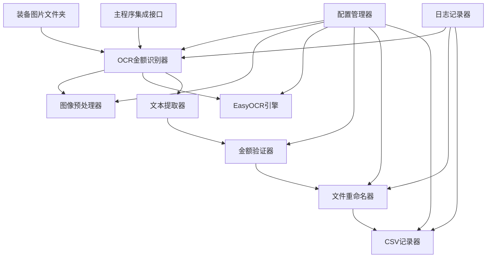
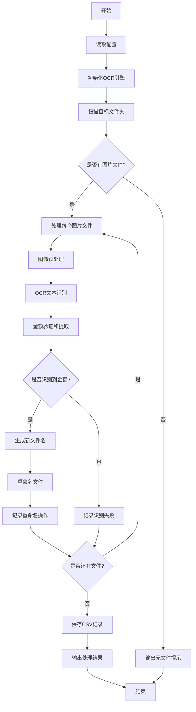

# OCR金额识别工具 - 架构设计文档

## 1. 项目概述

### 1.1 背景
基于现有的游戏装备图像识别系统，设计一个独立的OCR金额识别工具，用于识别装备图片中的金额信息（如金币数量"1500"），并将识别到的金额追加到文件名中，同时记录重命名操作到CSV文件。

### 1.2 目标
1. 读取`images/cropped_equipment_marker`文件夹中的装备图片
2. 识别每张图片中的金额信息
3. 重命名图片文件，将识别到的金额追加到原文件名后
4. 记录所有重命名操作到CSV文件
5. 使用EasyOCR作为识别引擎
6. 设计符合现有项目架构风格的独立工具

## 2. 系统架构设计

### 2.1 整体架构图

```
┌─────────────────────────────────────────────────────────────┐
│                   OCR金额识别工具系统                        │
├─────────────────────────────────────────────────────────────┤
│  ┌─────────────────┐  ┌─────────────────┐  ┌─────────────────┐ │
│  │   配置管理模块    │  │   OCR识别模块    │  │   文件处理模块    │ │
│  │                │  │                │  │                │ │
│  │ • OCR配置管理   │  │ • EasyOCR引擎   │  │ • 文件重命名     │ │
│  │ • 路径配置管理   │  │ • 图像预处理    │  │ • CSV记录生成   │ │
│  │ • 识别参数配置   │  │ • 文本识别      │  │ • 批量处理      │ │
│  └─────────────────┘  └─────────────────┘  └─────────────────┘ │
├─────────────────────────────────────────────────────────────┤
│  ┌─────────────────┐  ┌─────────────────┐  ┌─────────────────┐ │
│  │   日志记录模块    │  │   数据验证模块    │  │   集成接口模块    │ │
│  │                │  │                │  │                │ │
│  │ • 操作日志记录   │  │ • 金额格式验证   │  │ • 主程序集成     │ │
│  │ • 错误日志记录   │  │ • 识别结果验证   │  │ • 独立运行接口   │ │
│  │ • 性能监控      │  │ • 数据清洗      │  │ • 配置兼容性     │ │
│  └─────────────────┘  └─────────────────┘  └─────────────────┘ │
└─────────────────────────────────────────────────────────────┘
```

### 2.2 核心组件关系



## 3. 核心类设计

### 3.1 OCR金额识别器 (OCRAmountRecognizer)

```python
class OCRAmountRecognizer:
    """OCR金额识别器，负责识别装备图片中的金额信息"""
    
    def __init__(self, config_manager=None):
        """初始化OCR金额识别器
        
        Args:
            config_manager: 配置管理器实例，如果为None则使用默认配置
        """
        
    def recognize_amount(self, image_path: str) -> Optional[str]:
        """识别单张图片中的金额
        
        Args:
            image_path: 图片路径
            
        Returns:
            识别到的金额字符串，如果识别失败则返回None
        """
        
    def batch_recognize(self, image_folder: str) -> List[Dict[str, Any]]:
        """批量识别文件夹中的图片金额
        
        Args:
            image_folder: 图片文件夹路径
            
        Returns:
            识别结果列表，每个元素包含图片路径和识别到的金额
        """
        
    def process_and_rename(self, image_folder: str, csv_output_path: str) -> List[Dict[str, Any]]:
        """处理文件夹中的图片并重命名
        
        Args:
            image_folder: 图片文件夹路径
            csv_output_path: CSV输出文件路径
            
        Returns:
            处理结果列表，包含重命名操作详情
        """
```

### 3.2 图像预处理器 (ImagePreprocessor)

```python
class ImagePreprocessor:
    """图像预处理器，负责OCR前的图像处理"""
    
    def __init__(self, config: Dict[str, Any]):
        """初始化图像预处理器
        
        Args:
            config: 预处理配置字典
        """
        
    def preprocess_for_ocr(self, image_path: str) -> np.ndarray:
        """为OCR预处理图像
        
        Args:
            image_path: 图像路径
            
        Returns:
            预处理后的图像数组
        """
        
    def enhance_text_regions(self, image: np.ndarray) -> np.ndarray:
        """增强文本区域
        
        Args:
            image: 输入图像
            
        Returns:
            增强后的图像
        """
        
    def remove_background_noise(self, image: np.ndarray) -> np.ndarray:
        """移除背景噪声
        
        Args:
            image: 输入图像
            
        Returns:
            去噪后的图像
        """
```

### 3.3 金额验证器 (AmountValidator)

```python
class AmountValidator:
    """金额验证器，负责验证和清洗识别到的金额"""
    
    def __init__(self, config: Dict[str, Any]):
        """初始化金额验证器
        
        Args:
            config: 验证配置字典
        """
        
    def validate_amount(self, text: str) -> Optional[str]:
        """验证文本是否为有效金额
        
        Args:
            text: OCR识别到的文本
            
        Returns:
            验证后的金额字符串，如果无效则返回None
        """
        
    def clean_amount_text(self, text: str) -> str:
        """清洗金额文本
        
        Args:
            text: 原始文本
            
        Returns:
            清洗后的文本
        """
        
    def format_amount(self, amount: str) -> str:
        """格式化金额显示
        
        Args:
            amount: 金额字符串
            
        Returns:
            格式化后的金额字符串
        """
```

### 3.4 文件重命名器 (FileRenamer)

```python
class FileRenamer:
    """文件重命名器，负责根据识别结果重命名文件"""
    
    def __init__(self, config: Dict[str, Any]):
        """初始化文件重命名器
        
        Args:
            config: 重命名配置字典
        """
        
    def rename_with_amount(self, file_path: str, amount: str) -> Tuple[str, bool]:
        """为文件添加金额后缀
        
        Args:
            file_path: 原文件路径
            amount: 识别到的金额
            
        Returns:
            (新文件路径, 是否成功重命名) 的元组
        """
        
    def generate_new_filename(self, original_name: str, amount: str) -> str:
        """生成新的文件名
        
        Args:
            original_name: 原文件名
            amount: 金额字符串
            
        Returns:
            新文件名
        """
        
    def check_duplicate(self, new_path: str) -> str:
        """检查并处理重复文件名
        
        Args:
            new_path: 新文件路径
            
        Returns:
            最终的文件路径
        """
```

### 3.5 CSV记录器 (CSVRecorder)

```python
class CSVRecorder:
    """CSV记录器，负责记录重命名操作"""
    
    def __init__(self, csv_path: str, config: Dict[str, Any]):
        """初始化CSV记录器
        
        Args:
            csv_path: CSV文件路径
            config: 记录配置字典
        """
        
    def record_rename_operation(self, original_path: str, new_path: str, 
                               amount: str, confidence: float) -> None:
        """记录重命名操作
        
        Args:
            original_path: 原文件路径
            new_path: 新文件路径
            amount: 识别到的金额
            confidence: 识别置信度
        """
        
    def save_records(self) -> None:
        """保存记录到CSV文件"""
        
    def load_existing_records(self) -> List[Dict[str, Any]]:
        """加载已存在的记录
        
        Returns:
            已有记录列表
        """
```

## 4. 配置管理扩展

### 4.1 配置文件扩展

在现有的`config.json`中添加OCR相关配置：

```json
{
  "ocr": {
    "enabled": true,
    "engine": "easyocr",
    "languages": ["en"],
    "gpu_enabled": false,
    "confidence_threshold": 0.5,
    "text_detection": {
      "min_confidence": 0.3,
      "max_size": 1000,
      "contrast_enhancement": true,
      "noise_reduction": true
    },
    "amount_validation": {
      "patterns": ["\\d+", "\\d+[.,]\\d{1,2}", "\\d+[kKmM]"],
      "min_amount": 0,
      "max_amount": 999999999,
      "decimal_separator": ".",
      "thousands_separator": ","
    },
    "file_naming": {
      "separator": "_",
      "amount_prefix": "",
      "amount_suffix": "",
      "case_sensitive": false,
      "max_length": 255
    },
    "csv_output": {
      "enabled": true,
      "filename": "ocr_rename_records.csv",
      "include_timestamp": true,
      "include_confidence": true,
      "overwrite_existing": false
    }
  },
  "paths": {
    "cropped_equipment_marker_dir": "cropped_equipment_marker",
    "ocr_output_dir": "ocr_output",
    "ocr_logs_dir": "ocr_logs"
  }
}
```

### 4.2 配置管理器扩展

```python
class OCRConfigManager:
    """OCR配置管理器，继承现有配置管理器功能"""
    
    def __init__(self, config_manager: ConfigManager):
        """初始化OCR配置管理器
        
        Args:
            config_manager: 基础配置管理器实例
        """
        
    def get_ocr_config(self) -> Dict[str, Any]:
        """获取OCR相关配置
        
        Returns:
            OCR配置字典
        """
        
    def get_text_detection_config(self) -> Dict[str, Any]:
        """获取文本检测配置
        
        Returns:
            文本检测配置字典
        """
        
    def get_amount_validation_config(self) -> Dict[str, Any]:
        """获取金额验证配置
        
        Returns:
            金额验证配置字典
        """
        
    def get_file_naming_config(self) -> Dict[str, Any]:
        """获取文件命名配置
        
        Returns:
            文件命名配置字典
        """
        
    def get_csv_output_config(self) -> Dict[str, Any]:
        """获取CSV输出配置
        
        Returns:
            CSV输出配置字典
        """
```

## 5. 数据流设计

### 5.1 处理流程



### 5.2 数据结构

#### 5.2.1 识别结果数据结构

```python
@dataclass
class OCRResult:
    """OCR识别结果数据类"""
    image_path: str
    original_filename: str
    recognized_text: str
    extracted_amount: Optional[str]
    confidence: float
    processing_time: float
    success: bool
    error_message: Optional[str] = None
```

#### 5.2.2 重命名记录数据结构

```python
@dataclass
class RenameRecord:
    """文件重命名记录数据类"""
    timestamp: str
    original_path: str
    new_path: str
    original_filename: str
    new_filename: str
    extracted_amount: str
    confidence: float
    processing_time: float
    success: bool
    error_message: Optional[str] = None
```

## 6. 错误处理策略

### 6.1 错误分类

1. **文件系统错误**
   - 文件不存在
   - 权限不足
   - 磁盘空间不足

2. **图像处理错误**
   - 图像格式不支持
   - 图像损坏
   - 内存不足

3. **OCR识别错误**
   - OCR引擎初始化失败
   - 识别超时
   - 置信度过低

4. **数据验证错误**
   - 金额格式无效
   - 金额超出范围
   - 文件名冲突

### 6.2 错误处理机制

```python
class OCRErrorHandler:
    """OCR错误处理器"""
    
    def __init__(self, logger, config: Dict[str, Any]):
        """初始化错误处理器
        
        Args:
            logger: 日志记录器
            config: 错误处理配置
        """
        
    def handle_file_error(self, error: Exception, file_path: str) -> None:
        """处理文件相关错误
        
        Args:
            error: 异常对象
            file_path: 文件路径
        """
        
    def handle_ocr_error(self, error: Exception, image_path: str) -> None:
        """处理OCR相关错误
        
        Args:
            error: 异常对象
            image_path: 图像路径
        """
        
    def handle_validation_error(self, error: Exception, text: str) -> None:
        """处理验证相关错误
        
        Args:
            error: 异常对象
            text: 验证失败的文本
        """
        
    def should_retry(self, error: Exception, retry_count: int) -> bool:
        """判断是否应该重试
        
        Args:
            error: 异常对象
            retry_count: 当前重试次数
            
        Returns:
            是否应该重试
        """
```

## 7. 性能优化方案

### 7.1 批量处理优化

1. **并行处理**
   - 使用多线程/多进程处理多个图片
   - 合理控制并发数量，避免资源耗尽

2. **内存管理**
   - 及时释放图像内存
   - 使用图像缓存避免重复加载

3. **OCR引擎优化**
   - 预加载OCR模型
   - 批量图像识别

### 7.2 缓存策略

```python
class OCRCacheManager:
    """OCR缓存管理器"""
    
    def __init__(self, config: Dict[str, Any]):
        """初始化缓存管理器
        
        Args:
            config: 缓存配置
        """
        
    def get_cached_result(self, image_hash: str) -> Optional[OCRResult]:
        """获取缓存的识别结果
        
        Args:
            image_hash: 图像哈希值
            
        Returns:
            缓存的识别结果，如果不存在则返回None
        """
        
    def cache_result(self, image_hash: str, result: OCRResult) -> None:
        """缓存识别结果
        
        Args:
            image_hash: 图像哈希值
            result: 识别结果
        """
        
    def clear_cache(self) -> None:
        """清空缓存"""
```

## 8. 与现有系统的集成接口

### 8.1 主程序集成

```python
class OCRIntegration:
    """OCR工具集成接口"""
    
    def __init__(self, config_manager: ConfigManager):
        """初始化集成接口
        
        Args:
            config_manager: 配置管理器实例
        """
        
    def integrate_with_main_workflow(self, equipment_matcher: EquipmentMatcher) -> None:
        """与主工作流程集成
        
        Args:
            equipment_matcher: 装备匹配器实例
        """
        
    def post_processing_step(self, cropped_folder: str) -> List[Dict[str, Any]]:
        """作为后处理步骤执行OCR识别
        
        Args:
            cropped_folder: 切割后的装备文件夹
            
        Returns:
            OCR处理结果列表
        """
```

### 8.2 独立运行接口

```python
def run_ocr_standalone(config_path: str = "config.json") -> None:
    """独立运行OCR金额识别工具
    
    Args:
        config_path: 配置文件路径
    """
    
def main():
    """主程序入口点"""
    parser = argparse.ArgumentParser(description="OCR金额识别工具")
    parser.add_argument("--config", default="config.json", help="配置文件路径")
    parser.add_argument("--input-dir", help="输入图片目录")
    parser.add_argument("--output-csv", help="输出CSV文件路径")
    parser.add_argument("--dry-run", action="store_true", help="试运行模式，不实际重命名文件")
    
    args = parser.parse_args()
    
    # 运行OCR识别
    run_ocr_with_args(args)
```

## 9. 部署和维护

### 9.1 依赖管理

在`requirements.txt`中添加EasyOCR依赖：

```
# OCR识别引擎
easyocr>=1.6.0

# 图像处理优化
imagehash>=4.3.0
```

### 9.2 测试策略

1. **单元测试**
   - 测试各个组件的基本功能
   - 测试错误处理机制

2. **集成测试**
   - 测试与现有系统的集成
   - 测试完整的处理流程

3. **性能测试**
   - 测试批量处理性能
   - 测试内存使用情况

## 10. 总结

本架构设计文档详细描述了OCR金额识别工具的完整设计方案，包括：

1. **模块化设计**：遵循现有项目的模块化架构风格
2. **配置管理**：扩展现有配置系统，保持一致性
3. **错误处理**：完善的错误处理和日志记录机制
4. **性能优化**：支持批量处理和缓存优化
5. **集成接口**：提供独立运行和集成两种使用方式

该设计确保了OCR金额识别工具能够无缝集成到现有系统中，同时保持独立性和可扩展性。