# OCR金额识别工具 - 类图设计

## 1. 核心类图

```mermaid
classDiagram
    class OCRAmountRecognizer {
        -config_manager: ConfigManager
        -ocr_config_manager: OCRConfigManager
        -image_preprocessor: ImagePreprocessor
        -ocr_engine: EasyOCR
        -amount_validator: AmountValidator
        -file_renamer: FileRenamer
        -csv_recorder: CSVRecorder
        -logger: Logger
        -error_handler: OCRErrorHandler
        -cache_manager: OCRCacheManager
        
        +__init__(config_manager: ConfigManager)
        +recognize_amount(image_path: str) Optional~str~
        +batch_recognize(image_folder: str) List~Dict~
        +process_and_rename(image_folder: str, csv_output_path: str) List~Dict~
        -_initialize_ocr_engine() None
        -_process_single_image(image_path: str) OCRResult
        -_handle_recognition_result(result: OCRResult) RenameRecord
    }
    
    class ImagePreprocessor {
        -config: Dict~str, Any~
        -logger: Logger
        
        +__init__(config: Dict~str, Any~)
        +preprocess_for_ocr(image_path: str) np.ndarray
        +enhance_text_regions(image: np.ndarray) np.ndarray
        +remove_background_noise(image: np.ndarray) np.ndarray
        -_resize_image(image: np.ndarray) np.ndarray
        -_adjust_contrast(image: np.ndarray) np.ndarray
        -_apply_gaussian_blur(image: np.ndarray) np.ndarray
    }
    
    class AmountValidator {
        -config: Dict~str, Any~
        -amount_patterns: List~str~
        -logger: Logger
        
        +__init__(config: Dict~str, Any~)
        +validate_amount(text: str) Optional~str~
        +clean_amount_text(text: str) str
        +format_amount(amount: str) str
        -_extract_number_from_text(text: str) Optional~str~
        -_is_valid_amount_range(amount: float) bool
        -_normalize_amount(amount: str) str
    }
    
    class FileRenamer {
        -config: Dict~str, Any~
        -logger: Logger
        
        +__init__(config: Dict~str, Any~)
        +rename_with_amount(file_path: str, amount: str) Tuple~str, bool~
        +generate_new_filename(original_name: str, amount: str) str
        +check_duplicate(new_path: str) str
        -_validate_filename_length(filename: str) bool
        -_sanitize_filename(filename: str) str
        -_get_unique_filename(file_path: str) str
    }
    
    class CSVRecorder {
        -csv_path: str
        -config: Dict~str, Any~
        -records: List~RenameRecord~
        -fieldnames: List~str~
        -logger: Logger
        
        +__init__(csv_path: str, config: Dict~str, Any~)
        +record_rename_operation(original_path: str, new_path: str, amount: str, confidence: float) None
        +save_records() None
        +load_existing_records() List~Dict~str, Any~~
        -_initialize_csv_file() None
        -_validate_record_data(record: RenameRecord) bool
    }
    
    class OCRConfigManager {
        -base_config_manager: ConfigManager
        -ocr_config: Dict~str, Any~
        
        +__init__(config_manager: ConfigManager)
        +get_ocr_config() Dict~str, Any~~
        +get_text_detection_config() Dict~str, Any~~
        +get_amount_validation_config() Dict~str, Any~~
        +get_file_naming_config() Dict~str, Any~~
        +get_csv_output_config() Dict~str, Any~~
        -_load_ocr_config() None
        -_validate_config() bool
    }
    
    class OCRErrorHandler {
        -logger: Logger
        -config: Dict~str, Any~
        -retry_config: Dict~str, Any~
        
        +__init__(logger: Logger, config: Dict~str, Any~~)
        +handle_file_error(error: Exception, file_path: str) None
        +handle_ocr_error(error: Exception, image_path: str) None
        +handle_validation_error(error: Exception, text: str) None
        +should_retry(error: Exception, retry_count: int) bool
        -_log_error(error: Exception, context: str) None
        -_get_error_category(error: Exception) str
    }
    
    class OCRCacheManager {
        -config: Dict~str, Any~
        -cache: Dict~str, OCRResult~
        -max_cache_size: int
        -cache_hits: int
        -cache_misses: int
        
        +__init__(config: Dict~str, Any~~)
        +get_cached_result(image_hash: str) Optional~OCRResult~
        +cache_result(image_hash: str, result: OCRResult) None
        +clear_cache() None
        +get_cache_stats() Dict~str, Any~~
        -_generate_image_hash(image_path: str) str
        -_evict_old_entries() None
    }
    
    class OCRResult {
        +image_path: str
        +original_filename: str
        +recognized_text: str
        +extracted_amount: Optional~str~
        +confidence: float
        +processing_time: float
        +success: bool
        +error_message: Optional~str~
        
        +__init__(image_path: str, original_filename: str, recognized_text: str, extracted_amount: Optional~str~, confidence: float, processing_time: float, success: bool, error_message: Optional~str~)
        +to_dict() Dict~str, Any~~
        +from_dict(data: Dict~str, Any~~) OCRResult
    }
    
    class RenameRecord {
        +timestamp: str
        +original_path: str
        +new_path: str
        +original_filename: str
        +new_filename: str
        +extracted_amount: str
        +confidence: float
        +processing_time: float
        +success: bool
        +error_message: Optional~str~
        
        +__init__(timestamp: str, original_path: str, new_path: str, original_filename: str, new_filename: str, extracted_amount: str, confidence: float, processing_time: float, success: bool, error_message: Optional~str~)
        +to_dict() Dict~str, Any~~
        +from_dict(data: Dict~str, Any~~) RenameRecord
        +to_csv_row() Dict~str, Any~~
    }
    
    class OCRIntegration {
        -config_manager: ConfigManager
        -ocr_recognizer: OCRAmountRecognizer
        -logger: Logger
        
        +__init__(config_manager: ConfigManager)
        +integrate_with_main_workflow(equipment_matcher: EquipmentMatcher) None
        +post_processing_step(cropped_folder: str) List~Dict~str, Any~~
        -_setup_integration_config() None
        -_validate_integration_requirements() bool
    }
    
    %% 关系定义
    OCRAmountRecognizer --> OCRConfigManager : uses
    OCRAmountRecognizer --> ImagePreprocessor : uses
    OCRAmountRecognizer --> AmountValidator : uses
    OCRAmountRecognizer --> FileRenamer : uses
    OCRAmountRecognizer --> CSVRecorder : uses
    OCRAmountRecognizer --> OCRErrorHandler : uses
    OCRAmountRecognizer --> OCRCacheManager : uses
    OCRAmountRecognizer --> OCRResult : creates
    OCRAmountRecognizer --> RenameRecord : creates
    
    OCRConfigManager --> ConfigManager : extends
    
    FileRenamer --> RenameRecord : creates
    CSVRecorder --> RenameRecord : stores
    
    OCRIntegration --> OCRAmountRecognizer : uses
    OCRIntegration --> ConfigManager : uses
```



## 2. 类详细说明

### 2.1 OCRAmountRecognizer (核心控制器)

**职责**：
- 协调所有OCR相关组件
- 管理整个金额识别流程
- 提供对外接口

**关键方法**：
- `recognize_amount()`: 识别单张图片中的金额
- `batch_recognize()`: 批量识别文件夹中的图片
- `process_and_rename()`: 完整的处理流程（识别+重命名+记录）

### 2.2 ImagePreprocessor (图像预处理器)

**职责**：
- 为OCR准备图像
- 增强文本区域的可识别性
- 去除背景噪声

**关键方法**：
- `preprocess_for_ocr()`: 主要的预处理流程
- `enhance_text_regions()`: 专门增强文本区域
- `remove_background_noise()`: 去除干扰识别的背景

### 2.3 AmountValidator (金额验证器)

**职责**：
- 验证OCR识别的文本是否为有效金额
- 清洗和格式化金额数据
- 应用业务规则验证

**关键方法**：
- `validate_amount()`: 验证金额有效性
- `clean_amount_text()`: 清洗文本
- `format_amount()`: 格式化显示

### 2.4 FileRenamer (文件重命名器)

**职责**：
- 根据识别结果重命名文件
- 处理文件名冲突
- 确保文件名符合系统要求

**关键方法**：
- `rename_with_amount()`: 执行重命名操作
- `generate_new_filename()`: 生成新文件名
- `check_duplicate()`: 处理重复文件名

### 2.5 CSVRecorder (CSV记录器)

**职责**：
- 记录所有重命名操作
- 管理CSV文件的读写
- 提供数据导出功能

**关键方法**：
- `record_rename_operation()`: 记录单次操作
- `save_records()`: 保存到文件
- `load_existing_records()`: 加载历史记录

### 2.6 OCRConfigManager (配置管理器)

**职责**：
- 管理OCR相关配置
- 扩展现有配置系统
- 提供配置验证

**关键方法**：
- `get_ocr_config()`: 获取OCR主配置
- `get_text_detection_config()`: 获取文本检测配置
- `get_amount_validation_config()`: 获取验证配置

### 2.7 OCRErrorHandler (错误处理器)

**职责**：
- 统一处理各类错误
- 决定重试策略
- 记录错误日志

**关键方法**：
- `handle_file_error()`: 处理文件错误
- `handle_ocr_error()`: 处理OCR错误
- `should_retry()`: 判断是否重试

### 2.8 OCRCacheManager (缓存管理器)

**职责**：
- 管理识别结果缓存
- 提高重复处理效率
- 监控缓存性能

**关键方法**：
- `get_cached_result()`: 获取缓存结果
- `cache_result()`: 存储结果到缓存
- `get_cache_stats()`: 获取缓存统计

## 3. 数据类设计

### 3.1 OCRResult (识别结果)

```python
@dataclass
class OCRResult:
    """OCR识别结果数据类"""
    image_path: str
    original_filename: str
    recognized_text: str
    extracted_amount: Optional[str]
    confidence: float
    processing_time: float
    success: bool
    error_message: Optional[str] = None
    
    def to_dict() -> Dict[str, Any]:
        """转换为字典格式"""
        
    @classmethod
    def from_dict(cls, data: Dict[str, Any]) -> 'OCRResult':
        """从字典创建实例"""
```

### 3.2 RenameRecord (重命名记录)

```python
@dataclass
class RenameRecord:
    """文件重命名记录数据类"""
    timestamp: str
    original_path: str
    new_path: str
    original_filename: str
    new_filename: str
    extracted_amount: str
    confidence: float
    processing_time: float
    success: bool
    error_message: Optional[str] = None
    
    def to_dict() -> Dict[str, Any]:
        """转换为字典格式"""
        
    @classmethod
    def from_dict(cls, data: Dict[str, Any]) -> 'RenameRecord':
        """从字典创建实例"""
        
    def to_csv_row() -> Dict[str, Any]:
        """转换为CSV行格式"""
```

## 4. 接口设计

### 4.1 IOCRProcessor (OCR处理器接口)

```python
from abc import ABC, abstractmethod

class IOCRProcessor(ABC):
    """OCR处理器接口"""
    
    @abstractmethod
    def process_image(self, image_path: str) -> OCRResult:
        """处理单张图像
        
        Args:
            image_path: 图像路径
            
        Returns:
            OCR识别结果
        """
        pass
    
    @abstractmethod
    def batch_process(self, image_folder: str) -> List[OCRResult]:
        """批量处理图像
        
        Args:
            image_folder: 图像文件夹路径
            
        Returns:
            OCR识别结果列表
        """
        pass
```

### 4.2 IAmountValidator (金额验证器接口)

```python
class IAmountValidator(ABC):
    """金额验证器接口"""
    
    @abstractmethod
    def validate(self, text: str) -> Optional[str]:
        """验证文本是否为有效金额
        
        Args:
            text: 待验证文本
            
        Returns:
            验证后的金额，无效则返回None
        """
        pass
    
    @abstractmethod
    def format_amount(self, amount: str) -> str:
        """格式化金额显示
        
        Args:
            amount: 金额字符串
            
        Returns:
            格式化后的金额
        """
        pass
```

## 5. 扩展性设计

### 5.1 插件架构

```python
class OCREnginePlugin(ABC):
    """OCR引擎插件接口"""
    
    @abstractmethod
    def initialize(self, config: Dict[str, Any]) -> bool:
        """初始化OCR引擎
        
        Args:
            config: 引擎配置
            
        Returns:
            初始化是否成功
        """
        pass
    
    @abstractmethod
    def recognize_text(self, image: np.ndarray) -> Tuple[str, float]:
        """识别图像中的文本
        
        Args:
            image: 预处理后的图像
            
        Returns:
            (识别文本, 置信度) 的元组
        """
        pass
    
    @abstractmethod
    def cleanup(self) -> None:
        """清理资源"""
        pass
```

### 5.2 验证器插件

```python
class AmountValidatorPlugin(ABC):
    """金额验证器插件接口"""
    
    @abstractmethod
    def can_validate(self, text: str) -> bool:
        """判断是否能验证该文本
        
        Args:
            text: 待验证文本
            
        Returns:
            是否能验证
        """
        pass
    
    @abstractmethod
    def validate_and_extract(self, text: str) -> Optional[str]:
        """验证并提取金额
        
        Args:
            text: 待验证文本
            
        Returns:
            提取的金额，无效则返回None
        """
        pass
```

## 6. 设计模式应用

### 6.1 工厂模式

```python
class OCRProcessorFactory:
    """OCR处理器工厂"""
    
    @staticmethod
    def create_processor(config_manager: ConfigManager) -> OCRAmountRecognizer:
        """创建OCR处理器实例
        
        Args:
            config_manager: 配置管理器
            
        Returns:
            OCR处理器实例
        """
        ocr_config_manager = OCRConfigManager(config_manager)
        return OCRAmountRecognizer(ocr_config_manager)
```

### 6.2 策略模式

```python
class ValidationStrategy:
    """验证策略基类"""
    
    def validate(self, text: str) -> Optional[str]:
        raise NotImplementedError

class NumericAmountStrategy(ValidationStrategy):
    """数字金额验证策略"""
    
    def validate(self, text: str) -> Optional[str]:
        # 实现数字金额验证逻辑
        pass

class CurrencyAmountStrategy(ValidationStrategy):
    """货币金额验证策略"""
    
    def validate(self, text: str) -> Optional[str]:
        # 实现货币金额验证逻辑
        pass
```

### 6.3 观察者模式

```python
class OCRObservable:
    """OCR观察者模式实现"""
    
    def __init__(self):
        self._observers = []
    
    def add_observer(self, observer) -> None:
        """添加观察者"""
        self._observers.append(observer)
    
    def notify_observers(self, event: str, data: Any) -> None:
        """通知所有观察者"""
        for observer in self._observers:
            observer.update(event, data)

class OCRProgressObserver:
    """OCR进度观察者"""
    
    def update(self, event: str, data: Any) -> None:
        if event == "progress":
            print(f"处理进度: {data['current']}/{data['total']}")
```

## 7. 总结

本类图设计详细描述了OCR金额识别工具的完整类结构，包括：

1. **核心控制类**：OCRAmountRecognizer作为主控制器
2. **功能组件类**：各司其职的专门处理类
3. **数据类**：标准化的数据结构
4. **接口设计**：保证扩展性和可测试性
5. **设计模式**：提高代码质量和可维护性

该设计遵循了现有项目的架构风格，确保了代码的一致性和可维护性。