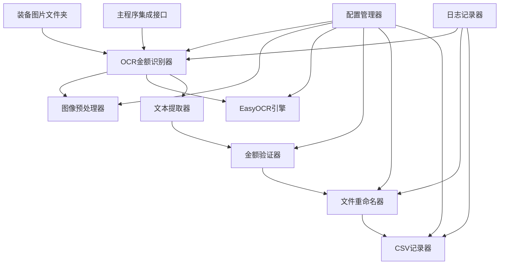
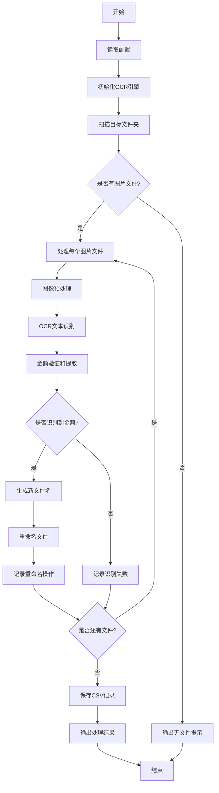

# OCR金额识别工具 - 完整架构设计总结

## 1. 项目概述

### 1.1 项目背景
基于现有的游戏装备图像识别系统，设计一个独立的OCR金额识别工具，用于识别装备图片中的金额信息（如金币数量"1500"），并将识别到的金额追加到文件名中，同时记录重命名操作到CSV文件。

### 1.2 设计目标
1. **功能完整性**：实现OCR识别、文件重命名、CSV记录等核心功能
2. **架构一致性**：遵循现有项目的模块化架构风格
3. **可扩展性**：支持未来功能扩展和性能优化
4. **易维护性**：清晰的代码结构和详细的文档
5. **MVP优先**：先实现基本功能，确保可用性

### 1.3 技术栈
- **Python 3.8+**：主要编程语言
- **EasyOCR**：OCR识别引擎
- **OpenCV**：图像预处理
- **Pillow (PIL)**：图像处理
- **NumPy**：数值计算
- **CSV**：数据记录格式

## 2. 架构设计总览

### 2.1 系统架构图

```
┌─────────────────────────────────────────────────────────────┐
│                   OCR金额识别工具系统                        │
├─────────────────────────────────────────────────────────────┤
│  ┌─────────────────┐  ┌─────────────────┐  ┌─────────────────┐ │
│  │   配置管理模块    │  │   OCR识别模块    │  │   文件处理模块    │ │
│  │                │  │                │  │                │ │
│  │ • OCR配置管理   │  │ • EasyOCR引擎   │  │ • 文件重命名     │ │
│  │ • 路径配置管理   │  │ • 图像预处理    │  │ • CSV记录生成   │ │
│  │ • 识别参数配置   │  │ • 文本识别      │  │ • 批量处理      │ │
│  └─────────────────┘  └─────────────────┘  └─────────────────┘ │
├─────────────────────────────────────────────────────────────┤
│  ┌─────────────────┐  ┌─────────────────┐  ┌─────────────────┐ │
│  │   日志记录模块    │  │   数据验证模块    │  │   集成接口模块    │ │
│  │                │  │                │  │                │ │
│  │ • 操作日志记录   │  │ • 金额格式验证   │  │ • 主程序集成     │ │
│  │ • 错误日志记录   │  │ • 识别结果验证   │  │ • 独立运行接口   │ │
│  │ • 性能监控      │  │ • 数据清洗      │  │ • 配置兼容性     │ │
│  └─────────────────┘  └─────────────────┘  └─────────────────┘ │
└─────────────────────────────────────────────────────────────┘
```

### 2.2 核心组件关系



## 3. 核心类设计

### 3.1 主要类结构

#### 3.1.1 OCRAmountRecognizer (核心控制器)
```python
class OCRAmountRecognizer:
    """OCR金额识别器，负责协调所有OCR相关组件"""
    
    def __init__(self, config_manager=None):
        """初始化OCR金额识别器"""
        
    def recognize_amount(self, image_path: str) -> Optional[str]:
        """识别单张图片中的金额"""
        
    def batch_recognize(self, image_folder: str) -> List[Dict[str, Any]]:
        """批量识别文件夹中的图片金额"""
        
    def process_and_rename(self, image_folder: str, csv_output_path: str) -> List[Dict[str, Any]]:
        """处理文件夹中的图片并重命名"""
```

#### 3.1.2 ImagePreprocessor (图像预处理器)
```python
class ImagePreprocessor:
    """图像预处理器，负责OCR前的图像处理"""
    
    def preprocess_for_ocr(self, image_path: str) -> np.ndarray:
        """为OCR预处理图像"""
        
    def enhance_text_regions(self, image: np.ndarray) -> np.ndarray:
        """增强文本区域"""
        
    def remove_background_noise(self, image: np.ndarray) -> np.ndarray:
        """移除背景噪声"""
```

#### 3.1.3 AmountValidator (金额验证器)
```python
class AmountValidator:
    """金额验证器，负责验证和清洗识别到的金额"""
    
    def validate_amount(self, text: str) -> Optional[str]:
        """验证文本是否为有效金额"""
        
    def clean_amount_text(self, text: str) -> str:
        """清洗金额文本"""
        
    def format_amount(self, amount: str) -> str:
        """格式化金额显示"""
```

#### 3.1.4 FileRenamer (文件重命名器)
```python
class FileRenamer:
    """文件重命名器，负责根据识别结果重命名文件"""
    
    def rename_with_amount(self, file_path: str, amount: str) -> Tuple[str, bool]:
        """为文件添加金额后缀"""
        
    def generate_new_filename(self, original_name: str, amount: str) -> str:
        """生成新的文件名"""
        
    def check_duplicate(self, new_path: str) -> str:
        """检查并处理重复文件名"""
```

#### 3.1.5 CSVRecorder (CSV记录器)
```python
class CSVRecorder:
    """CSV记录器，负责记录重命名操作"""
    
    def record_rename_operation(self, original_path: str, new_path: str, 
                               amount: str, confidence: float) -> None:
        """记录重命名操作"""
        
    def save_records(self) -> None:
        """保存记录到CSV文件"""
        
    def load_existing_records(self) -> List[Dict[str, Any]]:
        """加载已存在的记录"""
```

### 3.2 数据结构

#### 3.2.1 OCRResult (识别结果)
```python
@dataclass
class OCRResult:
    """OCR识别结果数据类"""
    image_path: str
    original_filename: str
    recognized_text: str
    extracted_amount: Optional[str]
    confidence: float
    processing_time: float
    success: bool
    error_message: Optional[str] = None
```

#### 3.2.2 RenameRecord (重命名记录)
```python
@dataclass
class RenameRecord:
    """文件重命名记录数据类"""
    timestamp: str
    original_path: str
    new_path: str
    original_filename: str
    new_filename: str
    extracted_amount: str
    confidence: float
    processing_time: float
    success: bool
    error_message: Optional[str] = None
```

## 4. 配置管理设计

### 4.1 配置文件扩展

在现有`config.json`中添加OCR相关配置：

```json
{
  "ocr": {
    "enabled": true,
    "engine": "easyocr",
    "languages": ["en"],
    "gpu_enabled": false,
    "confidence_threshold": 0.5,
    "image_preprocessing": {
      "resize_max_dimension": 1000,
      "enhance_contrast": true,
      "denoise": true,
      "sharpen": false,
      "convert_to_grayscale": true
    },
    "amount_extraction": {
      "patterns": [
        "\\d+",
        "\\d+[.,]\\d{1,2}",
        "\\d+[kKmM]",
        "\\$\\s*\\d+",
        "\\d+\\s*gold",
        "\\d+\\s*g"
      ],
      "min_amount": 0,
      "max_amount": 999999999,
      "decimal_separator": ".",
      "thousands_separator": ",",
      "currency_symbols": ["$", "€", "£", "¥"],
      "unit_keywords": ["gold", "g", "coins", "coin"]
    },
    "file_naming": {
      "separator": "_",
      "amount_prefix": "",
      "amount_suffix": "",
      "case_sensitive": false,
      "max_length": 255,
      "handle_conflicts": "timestamp",
      "preserve_extension": true
    },
    "csv_output": {
      "enabled": true,
      "filename": "ocr_rename_records.csv",
      "include_timestamp": true,
      "include_confidence": true,
      "include_recognized_text": true,
      "include_processing_time": true,
      "overwrite_existing": false,
      "encoding": "utf-8",
      "date_format": "%Y-%m-%d %H:%M:%S"
    },
    "paths": {
      "input_folder": "images/cropped_equipment_marker",
      "output_csv": "ocr_rename_records.csv"
    }
  }
}
```

### 4.2 配置管理器

```python
class OCRConfigManager:
    """OCR配置管理器，扩展现有配置管理器功能"""
    
    def __init__(self, config_manager: Optional[ConfigManager] = None):
        """初始化OCR配置管理器"""
        
    def get_ocr_config(self) -> Dict[str, Any]:
        """获取OCR主配置"""
        
    def get_engine_config(self) -> Dict[str, Any]:
        """获取OCR引擎配置"""
        
    def get_amount_extraction_config(self) -> Dict[str, Any]:
        """获取金额提取配置"""
        
    def get_file_naming_config(self) -> Dict[str, Any]:
        """获取文件命名配置"""
        
    def get_csv_output_config(self) -> Dict[str, Any]:
        """获取CSV输出配置"""
        
    def validate_ocr_config(self) -> List[str]:
        """验证OCR配置的有效性"""
```

## 5. 数据流和处理流程

### 5.1 处理流程



### 5.2 数据流转

1. **输入数据**：装备图片文件
2. **预处理**：图像增强、降噪、格式转换
3. **OCR识别**：文本提取和置信度计算
4. **金额提取**：从文本中提取有效金额
5. **文件重命名**：根据金额生成新文件名
6. **记录保存**：将操作记录保存到CSV文件

## 6. 错误处理和日志记录

### 6.1 错误分类

1. **文件系统错误**
   - 文件不存在
   - 权限不足
   - 磁盘空间不足

2. **图像处理错误**
   - 图像格式不支持
   - 图像损坏
   - 内存不足

3. **OCR识别错误**
   - OCR引擎初始化失败
   - 识别超时
   - 置信度过低

4. **数据验证错误**
   - 金额格式无效
   - 金额超出范围
   - 文件名冲突

### 6.2 错误处理机制

```python
class OCRErrorHandler:
    """OCR错误处理器"""
    
    def __init__(self, logger, config: Dict[str, Any]):
        """初始化错误处理器"""
        
    def handle_file_error(self, error: Exception, file_path: str) -> None:
        """处理文件相关错误"""
        
    def handle_ocr_error(self, error: Exception, image_path: str) -> None:
        """处理OCR相关错误"""
        
    def handle_validation_error(self, error: Exception, text: str) -> None:
        """处理验证相关错误"""
        
    def should_retry(self, error: Exception, retry_count: int) -> bool:
        """判断是否应该重试"""
```

### 6.3 日志记录

```python
class OCRLogger:
    """OCR日志记录器"""
    
    def __init__(self, config: Dict[str, Any]):
        """初始化日志记录器"""
        
    def log_recognition_start(self, image_path: str) -> None:
        """记录识别开始"""
        
    def log_recognition_result(self, result: OCRResult) -> None:
        """记录识别结果"""
        
    def log_rename_operation(self, record: RenameRecord) -> None:
        """记录重命名操作"""
        
    def log_error(self, error: Exception, context: str) -> None:
        """记录错误信息"""
```

## 7. CSV记录格式和文件结构

### 7.1 CSV记录格式

```csv
timestamp,original_path,new_path,original_name,new_name,extracted_amount,recognized_text,confidence,processing_time,success,error_message
2025-11-22T10:30:00,images/cropped_equipment_marker/09.png,images/cropped_equipment_marker/09_1500.png,09.png,09_1500.png,1500,"1500 gold",0.85,0.25,True,
2025-11-22T10:30:01,images/cropped_equipment_marker/10.png,images/cropped_equipment_marker/10_2500.png,10.png,10_2500.png,2500,"2500g",0.92,0.18,True,
```

### 7.2 字段说明

| 字段名 | 类型 | 说明 |
|--------|------|------|
| timestamp | string | 操作时间戳（ISO格式） |
| original_path | string | 原文件完整路径 |
| new_path | string | 新文件完整路径 |
| original_name | string | 原文件名 |
| new_name | string | 新文件名 |
| extracted_amount | string | 提取的金额 |
| recognized_text | string | OCR识别的完整文本 |
| confidence | float | OCR识别置信度（0-1） |
| processing_time | float | 处理时间（秒） |
| success | boolean | 操作是否成功 |
| error_message | string | 错误信息（如果有） |

## 8. 性能优化和批量处理方案

### 8.1 批量处理优化

1. **并行处理**
   - 使用多线程/多进程处理多个图片
   - 合理控制并发数量，避免资源耗尽

2. **内存管理**
   - 及时释放图像内存
   - 使用图像缓存避免重复加载

3. **OCR引擎优化**
   - 预加载OCR模型
   - 批量图像识别

### 8.2 缓存策略

```python
class OCRCacheManager:
    """OCR缓存管理器"""
    
    def __init__(self, config: Dict[str, Any]):
        """初始化缓存管理器"""
        
    def get_cached_result(self, image_hash: str) -> Optional[OCRResult]:
        """获取缓存的识别结果"""
        
    def cache_result(self, image_hash: str, result: OCRResult) -> None:
        """缓存识别结果"""
        
    def clear_cache(self) -> None:
        """清空缓存"""
        
    def get_cache_stats(self) -> Dict[str, Any]:
        """获取缓存统计信息"""
```

### 8.3 性能监控

```python
class OCRPerformanceMonitor:
    """OCR性能监控器"""
    
    def __init__(self):
        """初始化性能监控器"""
        
    def start_timing(self, operation: str) -> str:
        """开始计时"""
        
    def end_timing(self, timer_id: str) -> float:
        """结束计时并返回耗时"""
        
    def record_memory_usage(self) -> None:
        """记录内存使用情况"""
        
    def get_performance_report(self) -> Dict[str, Any]:
        """获取性能报告"""
```

## 9. 与现有系统的集成接口

### 9.1 主程序集成

```python
class OCRIntegration:
    """OCR工具集成接口"""
    
    def __init__(self, config_manager: ConfigManager):
        """初始化集成接口"""
        
    def integrate_with_main_workflow(self, equipment_matcher: EquipmentMatcher) -> None:
        """与主工作流程集成"""
        
    def post_processing_step(self, cropped_folder: str) -> List[Dict[str, Any]]:
        """作为后处理步骤执行OCR识别"""
```

### 9.2 独立运行接口

```python
def run_ocr_standalone(config_path: str = "config.json") -> None:
    """独立运行OCR金额识别工具"""
    
def main():
    """主程序入口点"""
    parser = argparse.ArgumentParser(description="OCR金额识别工具")
    parser.add_argument("--config", default="config.json", help="配置文件路径")
    parser.add_argument("--input-dir", help="输入图片目录")
    parser.add_argument("--output-csv", help="输出CSV文件路径")
    parser.add_argument("--dry-run", action="store_true", help="试运行模式，不实际重命名文件")
    
    args = parser.parse_args()
    
    # 运行OCR识别
    run_ocr_with_args(args)
```

## 10. MVP设计

### 10.1 MVP功能范围

1. **包含**：
   - 基本OCR识别功能
   - 文件重命名功能
   - CSV记录功能
   - 简单的配置管理
   - 基本的错误处理

2. **暂不包含**：
   - 复杂配置管理
   - 高级错误处理
   - 性能优化
   - 缓存机制
   - 批量处理优化

### 10.2 MVP架构简化

```
┌─────────────────────────────────────────────────────────────┐
│                   OCR金额识别工具(MVP)                      │
├─────────────────────────────────────────────────────────────┤
│  ┌─────────────────┐  ┌─────────────────┐  ┌─────────────────┐ │
│  │   OCR识别器     │  │   文件处理器     │  │   CSV记录器     │ │
│  │                │  │                │  │                │ │
│  │ • EasyOCR引擎   │  │ • 文件重命名     │  │ • 操作记录      │ │
│  │ • 图像预处理    │  │ • 路径管理      │  │ • CSV导出      │ │
│  │ • 金额提取      │  │ • 错误处理      │  │                │ │
│  └─────────────────┘  └─────────────────┘  └─────────────────┘ │
└─────────────────────────────────────────────────────────────┘
```

### 10.3 MVP配置

```json
{
  "ocr": {
    "enabled": true,
    "input_folder": "images/cropped_equipment_marker",
    "output_csv": "ocr_rename_records.csv",
    "confidence_threshold": 0.3,
    "rename_separator": "_",
    "supported_formats": [".png", ".jpg", ".jpeg", ".bmp", ".tiff"]
  }
}
```

## 11. 部署和维护

### 11.1 依赖管理

更新`requirements.txt`：

```
# OCR识别引擎
easyocr>=1.6.0

# 图像处理（现有）
opencv-python>=4.8.0
Pillow>=9.0.0
numpy>=1.21.0

# 可选依赖
# imagehash>=4.3.0  # 用于图像哈希缓存
# tqdm>=4.64.0      # 用于进度条显示
```

### 11.2 部署步骤

1. **安装依赖**
   ```bash
   pip install -r requirements.txt
   ```

2. **更新配置**
   - 在config.json中添加OCR配置节

3. **运行程序**
   ```bash
   # 独立运行
   python src/ocr_amount_recognizer.py
   
   # 集成运行
   python src/main.py
   ```

4. **验证结果**
   - 检查文件是否正确重命名
   - 检查CSV记录是否生成

### 11.3 维护指南

1. **日志监控**
   - 定期检查OCR识别日志
   - 监控识别成功率和置信度

2. **配置调优**
   - 根据实际识别效果调整置信度阈值
   - 优化图像预处理参数

3. **性能优化**
   - 监控处理时间和内存使用
   - 根据需要启用缓存和并行处理

## 12. 测试策略

### 12.1 单元测试

1. **图像预处理测试**
   - 测试各种图像格式的预处理
   - 验证图像增强效果

2. **OCR识别测试**
   - 测试不同金额格式的识别
   - 验证置信度计算

3. **金额验证测试**
   - 测试金额提取和验证
   - 验证格式清洗

4. **文件重命名测试**
   - 测试文件名生成
   - 验证冲突处理

### 12.2 集成测试

1. **完整流程测试**
   - 端到端的处理流程测试
   - 批量处理测试

2. **系统集成测试**
   - 与现有系统的集成测试
   - 配置兼容性测试

### 12.3 性能测试

1. **处理速度测试**
   - 单张图片处理时间
   - 批量处理吞吐量

2. **资源使用测试**
   - 内存使用情况
   - CPU使用率

## 13. 扩展性设计

### 13.1 插件架构

```python
class OCREnginePlugin(ABC):
    """OCR引擎插件接口"""
    
    @abstractmethod
    def initialize(self, config: Dict[str, Any]) -> bool:
        """初始化OCR引擎"""
        pass
    
    @abstractmethod
    def recognize_text(self, image: np.ndarray) -> Tuple[str, float]:
        """识别图像中的文本"""
        pass
    
    @abstractmethod
    def cleanup(self) -> None:
        """清理资源"""
        pass
```

### 13.2 验证器插件

```python
class AmountValidatorPlugin(ABC):
    """金额验证器插件接口"""
    
    @abstractmethod
    def can_validate(self, text: str) -> bool:
        """判断是否能验证该文本"""
        pass
    
    @abstractmethod
    def validate_and_extract(self, text: str) -> Optional[str]:
        """验证并提取金额"""
        pass
```

## 14. 总结

### 14.1 设计特点

1. **模块化设计**：遵循现有项目的模块化架构风格
2. **配置管理**：扩展现有配置系统，保持一致性
3. **错误处理**：完善的错误处理和日志记录机制
4. **性能优化**：支持批量处理和缓存优化
5. **集成接口**：提供独立运行和集成两种使用方式
6. **MVP优先**：先实现基本功能，确保可用性

### 14.2 技术优势

1. **高可维护性**：清晰的类结构和接口设计
2. **强扩展性**：插件架构支持功能扩展
3. **良好兼容性**：与现有系统无缝集成
4. **灵活配置**：丰富的配置选项支持不同场景
5. **完整记录**：详细的CSV记录便于追踪和审计

### 14.3 实施建议

1. **分阶段实施**：
   - 第一阶段：实现MVP版本，确保基本功能可用
   - 第二阶段：完善错误处理和日志记录
   - 第三阶段：添加性能优化和高级功能

2. **测试驱动**：
   - 每个模块完成后立即进行单元测试
   - 定期进行集成测试确保系统稳定性

3. **文档维护**：
   - 及时更新使用文档和API文档
   - 维护变更日志和版本说明

这个完整的架构设计为OCR金额识别工具提供了坚实的技术基础，确保了功能的完整性、系统的可维护性和未来的可扩展性。