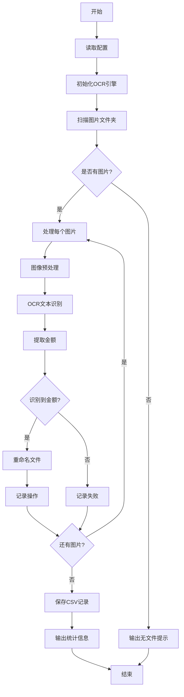

# OCR金额识别工具 - MVP设计文档

## 1. MVP目标

### 1.1 核心功能
1. 读取`images/cropped_equipment_marker`文件夹中的装备图片
2. 使用EasyOCR识别每张图片中的金额信息（如金币数量"1500"）
3. 重命名图片文件，将识别到的金额追加到原文件名后（如：09.png -> 09_1500.png）
4. 记录所有重命名操作到CSV文件中

### 1.2 MVP范围
- **包含**：基本OCR识别、文件重命名、CSV记录
- **暂不包含**：复杂配置管理、高级错误处理、性能优化、缓存机制

## 2. MVP架构设计

### 2.1 简化架构图

```
┌─────────────────────────────────────────────────────────────┐
│                   OCR金额识别工具(MVP)                      │
├─────────────────────────────────────────────────────────────┤
│  ┌─────────────────┐  ┌─────────────────┐  ┌─────────────────┐ │
│  │   OCR识别器     │  │   文件处理器     │  │   CSV记录器     │ │
│  │                │  │                │  │                │ │
│  │ • EasyOCR引擎   │  │ • 文件重命名     │  │ • 操作记录      │ │
│  │ • 图像预处理    │  │ • 路径管理      │  │ • CSV导出      │ │
│  │ • 金额提取      │  │ • 错误处理      │  │                │ │
│  └─────────────────┘  └─────────────────┘  └─────────────────┘ │
└─────────────────────────────────────────────────────────────┘
```

### 2.2 MVP核心类设计

#### 2.2.1 OCRAmountRecognizer (MVP版本)

```python
import os
import cv2
import numpy as np
import easyocr
import re
import csv
from datetime import datetime
from typing import List, Optional, Dict, Any
from pathlib import Path

class OCRAmountRecognizer:
    """OCR金额识别器 - MVP版本"""
    
    def __init__(self, input_folder: str = "images/cropped_equipment_marker", 
                 output_csv: str = "ocr_rename_records.csv"):
        """初始化OCR金额识别器
        
        Args:
            input_folder: 输入图片文件夹
            output_csv: 输出CSV文件路径
        """
        self.input_folder = input_folder
        self.output_csv = output_csv
        self.reader = None
        self.rename_records = []
        
        # 初始化OCR引擎
        self._initialize_ocr()
    
    def _initialize_ocr(self) -> None:
        """初始化EasyOCR引擎"""
        try:
            print("正在初始化OCR引擎...")
            self.reader = easyocr.Reader(['en'])  # 使用英文识别
            print("✓ OCR引擎初始化成功")
        except Exception as e:
            print(f"❌ OCR引擎初始化失败: {e}")
            raise
    
    def preprocess_image(self, image_path: str) -> np.ndarray:
        """预处理图像以提高OCR识别率
        
        Args:
            image_path: 图像路径
            
        Returns:
            预处理后的图像数组
        """
        # 读取图像
        image = cv2.imread(image_path)
        if image is None:
            raise ValueError(f"无法读取图像: {image_path}")
        
        # 转换为灰度图
        gray = cv2.cvtColor(image, cv2.COLOR_BGR2GRAY)
        
        # 增强对比度
        clahe = cv2.createCLAHE(clipLimit=2.0, tileGridSize=(8, 8))
        enhanced = clahe.apply(gray)
        
        # 降噪
        denoised = cv2.bilateralFilter(enhanced, 9, 75, 75)
        
        return denoised
    
    def extract_amount_from_text(self, text: str) -> Optional[str]:
        """从OCR识别的文本中提取金额
        
        Args:
            text: OCR识别的文本
            
        Returns:
            提取的金额字符串，如果未找到则返回None
        """
        # 常见金额模式
        patterns = [
            r'\b\d{1,3}(?:,\d{3})*(?:\.\d{2})?\b',  # 1,000.00 格式
            r'\b\d{1,6}\b',                           # 简单数字
            r'\b\d+[kK]\b',                           # 如 1500k
            r'\b\d+[mM]\b',                           # 如 1500m
        ]
        
        for pattern in patterns:
            matches = re.findall(pattern, text)
            if matches:
                # 返回第一个匹配的金额
                amount = matches[0]
                # 清理并标准化
                amount = amount.replace(',', '').replace('k', '000').replace('m', '000000')
                return amount
        
        return None
    
    def recognize_amount(self, image_path: str) -> Dict[str, Any]:
        """识别单张图片中的金额
        
        Args:
            image_path: 图片路径
            
        Returns:
            识别结果字典
        """
        try:
            # 预处理图像
            processed_image = self.preprocess_image(image_path)
            
            # OCR识别
            results = self.reader.readtext(processed_image)
            
            # 提取文本
            all_text = ' '.join([result[1] for result in results])
            
            # 提取金额
            amount = self.extract_amount_from_text(all_text)
            
            # 计算平均置信度
            avg_confidence = sum(result[2] for result in results) / len(results) if results else 0
            
            return {
                'success': True,
                'image_path': image_path,
                'recognized_text': all_text,
                'extracted_amount': amount,
                'confidence': avg_confidence,
                'error': None
            }
            
        except Exception as e:
            return {
                'success': False,
                'image_path': image_path,
                'recognized_text': None,
                'extracted_amount': None,
                'confidence': 0,
                'error': str(e)
            }
    
    def rename_file_with_amount(self, image_path: str, amount: str) -> Dict[str, Any]:
        """为文件添加金额后缀
        
        Args:
            image_path: 原文件路径
            amount: 金额字符串
            
        Returns:
            重命名结果字典
        """
        try:
            path = Path(image_path)
            
            # 构造新文件名
            new_name = f"{path.stem}_{amount}{path.suffix}"
            new_path = path.parent / new_name
            
            # 检查文件是否已存在
            if new_path.exists():
                # 添加时间戳避免冲突
                timestamp = datetime.now().strftime("%H%M%S")
                new_name = f"{path.stem}_{amount}_{timestamp}{path.suffix}"
                new_path = path.parent / new_name
            
            # 重命名文件
            os.rename(image_path, str(new_path))
            
            return {
                'success': True,
                'original_path': image_path,
                'new_path': str(new_path),
                'original_name': path.name,
                'new_name': new_name,
                'amount': amount,
                'error': None
            }
            
        except Exception as e:
            return {
                'success': False,
                'original_path': image_path,
                'new_path': None,
                'original_name': Path(image_path).name,
                'new_name': None,
                'amount': amount,
                'error': str(e)
            }
    
    def record_rename_operation(self, rename_result: Dict[str, Any], 
                              ocr_result: Dict[str, Any]) -> None:
        """记录重命名操作
        
        Args:
            rename_result: 重命名结果
            ocr_result: OCR识别结果
        """
        record = {
            'timestamp': datetime.now().isoformat(),
            'original_path': rename_result['original_path'],
            'new_path': rename_result['new_path'],
            'original_name': rename_result['original_name'],
            'new_name': rename_result['new_name'],
            'extracted_amount': rename_result['amount'],
            'recognized_text': ocr_result['recognized_text'],
            'confidence': ocr_result['confidence'],
            'success': rename_result['success'] and ocr_result['success']
        }
        
        self.rename_records.append(record)
    
    def save_records_to_csv(self) -> None:
        """保存记录到CSV文件"""
        if not self.rename_records:
            print("没有记录需要保存")
            return
        
        try:
            # 检查文件是否存在，决定是否写入表头
            file_exists = os.path.exists(self.output_csv)
            
            with open(self.output_csv, 'a', newline='', encoding='utf-8') as csvfile:
                fieldnames = [
                    'timestamp', 'original_path', 'new_path', 'original_name', 
                    'new_name', 'extracted_amount', 'recognized_text', 
                    'confidence', 'success'
                ]
                writer = csv.DictWriter(csvfile, fieldnames=fieldnames)
                
                # 如果文件不存在，写入表头
                if not file_exists:
                    writer.writeheader()
                
                # 写入所有记录
                writer.writerows(self.rename_records)
            
            print(f"✓ 已保存 {len(self.rename_records)} 条记录到 {self.output_csv}")
            
        except Exception as e:
            print(f"❌ 保存CSV文件失败: {e}")
    
    def process_all_images(self) -> Dict[str, Any]:
        """处理文件夹中的所有图片
        
        Returns:
            处理结果统计
        """
        # 获取所有图片文件
        image_extensions = ['.png', '.jpg', '.jpeg', '.bmp', '.tiff']
        image_files = []
        
        for ext in image_extensions:
            image_files.extend(Path(self.input_folder).glob(f'*{ext}'))
        
        if not image_files:
            print(f"在 {self.input_folder} 中未找到图片文件")
            return {'total_files': 0, 'processed': 0, 'renamed': 0, 'failed': 0}
        
        print(f"找到 {len(image_files)} 个图片文件")
        
        # 统计信息
        stats = {
            'total_files': len(image_files),
            'processed': 0,
            'renamed': 0,
            'failed': 0
        }
        
        # 处理每个文件
        for image_file in image_files:
            print(f"\n处理文件: {image_file.name}")
            
            # OCR识别
            ocr_result = self.recognize_amount(str(image_file))
            stats['processed'] += 1
            
            if not ocr_result['success']:
                print(f"❌ OCR识别失败: {ocr_result['error']}")
                stats['failed'] += 1
                continue
            
            print(f"识别文本: {ocr_result['recognized_text']}")
            print(f"置信度: {ocr_result['confidence']:.2f}")
            
            if not ocr_result['extracted_amount']:
                print("⚠️ 未识别到金额信息")
                stats['failed'] += 1
                continue
            
            print(f"提取金额: {ocr_result['extracted_amount']}")
            
            # 重命名文件
            rename_result = self.rename_file_with_amount(
                str(image_file), 
                ocr_result['extracted_amount']
            )
            
            if rename_result['success']:
                print(f"✓ 文件已重命名: {rename_result['new_name']}")
                stats['renamed'] += 1
            else:
                print(f"❌ 重命名失败: {rename_result['error']}")
                stats['failed'] += 1
            
            # 记录操作
            self.record_rename_operation(rename_result, ocr_result)
        
        # 保存记录
        self.save_records_to_csv()
        
        return stats
```

#### 2.2.2 主程序入口 (MVP版本)

```python
def main():
    """主程序入口 - MVP版本"""
    print("=" * 60)
    print("OCR金额识别工具 - MVP版本")
    print("=" * 60)
    
    # 配置参数
    input_folder = "images/cropped_equipment_marker"
    output_csv = "ocr_rename_records.csv"
    
    # 检查输入文件夹是否存在
    if not os.path.exists(input_folder):
        print(f"❌ 输入文件夹不存在: {input_folder}")
        return
    
    try:
        # 创建OCR识别器
        recognizer = OCRAmountRecognizer(input_folder, output_csv)
        
        # 处理所有图片
        print(f"\n开始处理文件夹: {input_folder}")
        stats = recognizer.process_all_images()
        
        # 输出统计信息
        print("\n" + "=" * 60)
        print("处理完成！统计信息:")
        print(f"总文件数: {stats['total_files']}")
        print(f"已处理: {stats['processed']}")
        print(f"已重命名: {stats['renamed']}")
        print(f"失败: {stats['failed']}")
        print(f"成功率: {stats['renamed']/stats['total_files']*100:.1f}%" if stats['total_files'] > 0 else "N/A")
        print(f"记录文件: {output_csv}")
        print("=" * 60)
        
    except Exception as e:
        print(f"❌ 程序执行失败: {e}")

if __name__ == "__main__":
    main()
```

## 3. MVP配置扩展

### 3.1 简化的配置扩展

在现有`config.json`中添加最小化的OCR配置：

```json
{
  "ocr": {
    "enabled": true,
    "input_folder": "images/cropped_equipment_marker",
    "output_csv": "ocr_rename_records.csv",
    "confidence_threshold": 0.3,
    "rename_separator": "_",
    "supported_formats": [".png", ".jpg", ".jpeg", ".bmp", ".tiff"]
  }
}
```

### 3.2 配置读取器 (MVP版本)

```python
import json

class MVPOCRConfig:
    """MVP版本的OCR配置读取器"""
    
    def __init__(self, config_path: str = "config.json"):
        """初始化配置读取器
        
        Args:
            config_path: 配置文件路径
        """
        self.config_path = config_path
        self.config = self._load_config()
    
    def _load_config(self) -> Dict[str, Any]:
        """加载配置文件"""
        try:
            with open(self.config_path, 'r', encoding='utf-8') as f:
                return json.load(f)
        except FileNotFoundError:
            print(f"配置文件不存在: {self.config_path}，使用默认配置")
            return self._get_default_config()
        except json.JSONDecodeError as e:
            print(f"配置文件格式错误: {e}，使用默认配置")
            return self._get_default_config()
    
    def _get_default_config(self) -> Dict[str, Any]:
        """获取默认配置"""
        return {
            "ocr": {
                "enabled": True,
                "input_folder": "images/cropped_equipment_marker",
                "output_csv": "ocr_rename_records.csv",
                "confidence_threshold": 0.3,
                "rename_separator": "_",
                "supported_formats": [".png", ".jpg", ".jpeg", ".bmp", ".tiff"]
            }
        }
    
    def get_ocr_config(self) -> Dict[str, Any]:
        """获取OCR配置"""
        return self.config.get("ocr", self._get_default_config()["ocr"])
```

## 4. MVP数据流

### 4.1 简化的处理流程



### 4.2 CSV记录格式 (MVP版本)

```csv
timestamp,original_path,new_path,original_name,new_name,extracted_amount,recognized_text,confidence,success
2025-11-22T10:30:00,images/cropped_equipment_marker/09.png,images/cropped_equipment_marker/09_1500.png,09.png,09_1500.png,1500,"1500 gold",0.85,True
```

## 5. MVP依赖管理

### 5.1 更新requirements.txt

```
# OCR识别引擎
easyocr>=1.6.0

# 图像处理（现有）
opencv-python>=4.8.0
Pillow>=9.0.0
numpy>=1.21.0
```

## 6. MVP测试计划

### 6.1 基本功能测试

1. **文件读取测试**
   - 验证能正确读取图片文件夹
   - 验证能识别支持的图片格式

2. **OCR识别测试**
   - 验证能识别简单数字
   - 验证能识别带逗号的数字
   - 验证能识别带k/m后缀的数字

3. **文件重命名测试**
   - 验证能正确重命名文件
   - 验证能处理文件名冲突

4. **CSV记录测试**
   - 验证能正确生成CSV文件
   - 验证记录格式正确

### 6.2 错误处理测试

1. **文件不存在**
2. **OCR识别失败**
3. **文件重命名失败**
4. **CSV写入失败**

## 7. MVP部署步骤

1. **安装依赖**
   ```bash
   pip install easyocr>=1.6.0
   ```

2. **更新配置**
   - 在config.json中添加OCR配置节

3. **运行程序**
   ```bash
   python src/ocr_amount_recognizer_mvp.py
   ```

4. **验证结果**
   - 检查文件是否正确重命名
   - 检查CSV记录是否生成

## 8. MVP限制和后续改进

### 8.1 当前限制

1. **配置管理**：仅支持基本配置，无动态更新
2. **错误处理**：仅有基本错误捕获，无详细分类处理
3. **性能优化**：无批量处理优化，无缓存机制
4. **日志记录**：仅有控制台输出，无详细日志文件
5. **OCR精度**：仅使用基础预处理，识别精度有限

### 8.2 后续改进方向

1. **增强图像预处理**：提高OCR识别精度
2. **添加更多金额格式**：支持更复杂的金额表示
3. **批量处理优化**：提高处理速度
4. **详细日志系统**：便于问题排查
5. **配置管理增强**：支持动态配置更新
6. **错误处理增强**：更细致的错误分类和处理

## 9. 总结

MVP设计专注于核心功能的快速实现，确保基本可用性。通过简化架构和功能，可以快速验证OCR金额识别的可行性，为后续的完整版本提供基础。

MVP版本包含：
- 基本的OCR识别功能
- 文件重命名功能
- CSV记录功能
- 简单的配置管理
- 基本的错误处理

这个设计确保了功能的可用性，同时保持了代码的简洁性和可维护性。